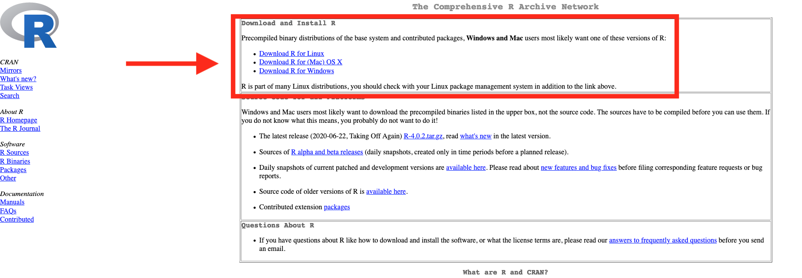
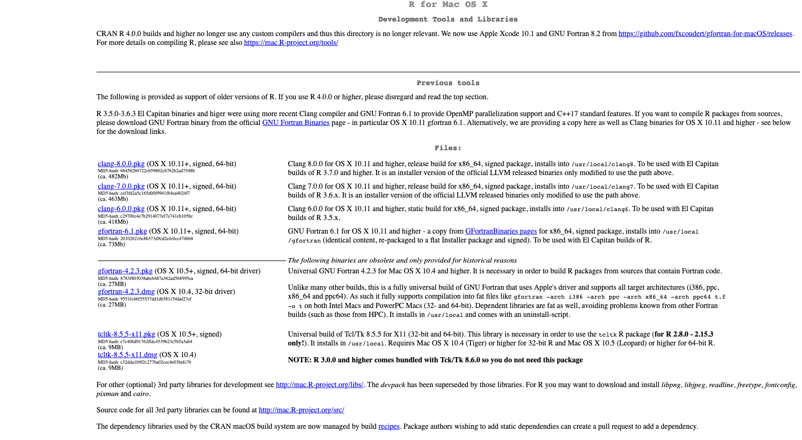
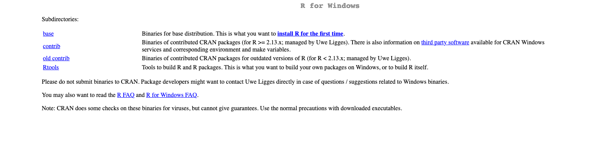
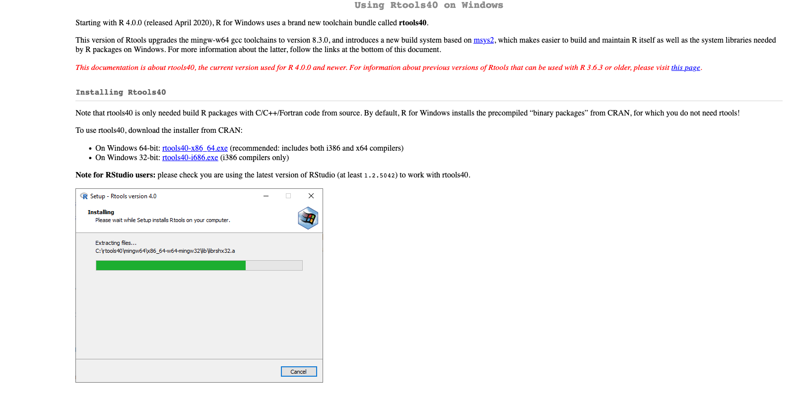

# R - Installing R

Rodrigo Esteves de Lima Lopes \
*Campinas State University* \
[rll307@unicamp.br](mailto:rll307@unicamp.br)

## Introduction

[R](https://www.r-project.org/) is a statistical analysis software. It was not necessarily created for use in language studies; however, it has proved to be quite useful for such a function. [R](https://www.r-project.org/) is package-based: each time we load a package, there is a pre-defined set of pre-programmed functions. Here we are not going to create packages, but we will use those functions to do our research projects. Here [R](https://www.r-project.org/) will serve us with the *** only *** purposes of analysing, formatting and presenting data.

## Download R

Go to [R](https://www.r-project.org/) website and download the latest version of R to your computer. There are binary versions for macOS, Linux and Windows. I do not have a Windows computer since 1999, so probably I will not be able to help you much if there is a Windows-specific issue. 

After you install R, I would strongly suggest you go to download and install some tools which might aid us to install some packages. If you are using a macOS computer, n the same link you downloaded R, scroll to the bottom of the page click on *tools*, install the following software:

* clang
* gfortran
* tcltk

If you are using Windows, download and install rtools.exe. 

