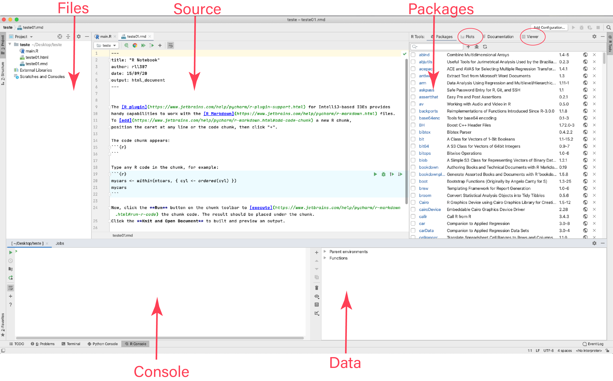

# IDE layouts

Any **R** IDE is composed by at least four quadrants:

1. One displaying the script we are working in
1. One emulating R console
1. One displaying visualisations and plots
1. One displaying our system variables

We should also consider that some other functions might be present, such as a file explorer and a tab for package management. For example, it hows it looks like in a Rstudio (with the original look and no personalisation):

Since my IDEs are highly customised, I am editing some screenshots I got from the internet, this is why we do not see the tab terminal (for terminal emulation) in the image above. 

As we can see, the same elements are in the PyCharm IDE, but are located in different places:

During the coding (classes and tutorials), I will refer to these IDEs tabs by their names).

Rodrigo Esteves de Lima Lopes \
*Campinas State University* \
[rll307@unicamp.br](mailto:rll307@unicamp.br)
