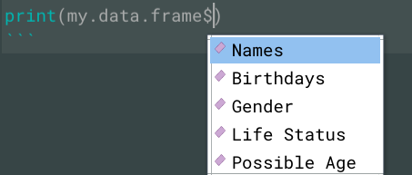

# Basic concepts with R (part 4)

Rodrigo Esteves de Lima Lopes \
*Campinas State University* \
[rll307@unicamp.br](mailto:rll307@unicamp.br)


# Introduction

In this tutorial we will work with data frames. On my little experience using R for language analysis, data frames are probably the most useful data structure. It is also important to say that there is a number of operations on data frames that probably will not be covered in this tutorial, mostly because they are so many, that we will learn them along the way. 

# Data Frames

Data frames are matrices like two-dimensional rectangular structures. However, they bring an important difference: data frame columns do not need to be all of the same data kind. In other words, we cam mix up, numbers, characters, logical, date in a complex table. A example would be:


Naturally there are restrictions, since such a freedom concerns only the kind of data represented within each column. for example, in the table that follows:


```
##       Names  Birthdays Gender Life.Status Possible.Age
## 1   Astolfo 1907-06-22   male       FALSE          113
## 2 Eleutério 1987-07-12   male        TRUE           33
## 3   Alarico 1941-11-10   male       FALSE           79
## 4   Genésia 1940-11-15 female        TRUE           80
## 5  Gioconda 1910-07-03 female       FALSE          110
## 6    Ondina 1982-06-21 female        TRUE           38
```

1. *Names* -> characters
1. *Birthdays* -> date
1. *Gender* -> characters
1. *Life Status* -> logical
1. *Possible age* -> numeric

Let us build this data frame:


```r
names <- c('Astolfo', "Eleutério", "Alarico", "Genésia","Gioconda","Ondina")
birthdays <- as.Date(c("1907-06-22","1987-07-12","1941-11-10",
                      "1940-11-15","1910-07-03","1982-06-21"))
gender <- c("male","male",'male', "female","female","female")
life.status <- c(FALSE,TRUE,FALSE,TRUE,FALSE,TRUE)
possible.age <- c(113,33, 79,80,110,38)
my.data.frame <- data.frame(names,birthdays,gender,life.status,possible.age)
colnames(my.data.frame) <- c("Names", 'Birthdays',"Gender","Life.Status",
                            "Possible.Age")
my.data.frame
```

```
##       Names  Birthdays Gender Life.Status Possible.Age
## 1   Astolfo 1907-06-22   male       FALSE          113
## 2 Eleutério 1987-07-12   male        TRUE           33
## 3   Alarico 1941-11-10   male       FALSE           79
## 4   Genésia 1940-11-15 female        TRUE           80
## 5  Gioconda 1910-07-03 female       FALSE          110
## 6    Ondina 1982-06-21 female        TRUE           38
```


In the code above:

1. We created 5 vectors (2 characters, 1 logical, 1 number and 1 date)
1. These vectors were merged into a data frame using the command `data.frame()`
1. When I merge vectors into a data frame, the name of my vectors become the name of the columns
1. The command `colnames()` allows me to change that to a more "clear" set of names.
  - Note that the new names is in a vector and it has on name per column, not more, not less. 


Now let us check its structure:


```r
str(my.data.frame)
```

```
## 'data.frame':	6 obs. of  5 variables:
##  $ Names       : chr  "Astolfo" "Eleutério" "Alarico" "Genésia" ...
##  $ Birthdays   : Date, format: "1907-06-22" "1987-07-12" ...
##  $ Gender      : chr  "male" "male" "male" "female" ...
##  $ Life.Status : logi  FALSE TRUE FALSE TRUE FALSE TRUE
##  $ Possible.Age: num  113 33 79 80 110 38
```

The command `str()` brings us first idea of our data frame. Besides what we already know, it tells me `my.data.frame` has 6 observations (rows) and 5 variables (columns). Let us try something new:


```r
summary(my.data.frame)
```

```
##     Names             Birthdays             Gender          Life.Status    
##  Length:6           Min.   :1907-06-22   Length:6           Mode :logical  
##  Class :character   1st Qu.:1918-02-04   Class :character   FALSE:3        
##  Mode  :character   Median :1941-05-14   Mode  :character   TRUE :3        
##                     Mean   :1945-02-12                                     
##                     3rd Qu.:1972-04-25                                     
##                     Max.   :1987-07-12                                     
##   Possible.Age   
##  Min.   : 33.00  
##  1st Qu.: 48.25  
##  Median : 79.50  
##  Mean   : 75.50  
##  3rd Qu.:102.50  
##  Max.   :113.00
```

The command `summary()` brings a different kind of information:

1. In **character** columns, it shows the number of observations and the class
1. In  **date** and **numeric** columns it prints the minimum, maximum, median and mean values
1. In **logical** columns it brings the summary of *TRUE* e *FALSE* occurrences


Some particularities of data frames should be kept in mind:

- The column names cannot be empty
- Row names have to be unique
- Each column have to consist of same number of items


# Subetting a data frame

There are some ways of accessing data inside a data frame, here we are going to discuss some

## Dollar sign ($)

The dollar sign help us to access a column inside a data frame. This is useful for both creating a new variable or telling another command to use that specific data:


```r
print(my.data.frame$Names)
```

```
## [1] "Astolfo"   "Eleutério" "Alarico"   "Genésia"   "Gioconda"  "Ondina"
```

The beauty of it is that your IDE already recognise the columns and will give you a hand:




## Indexing

The index system we learnt to manipulate matrices is also useful for data frames. So we can access specific values inside a matrix. 


Accessing a single cell

```r
my.data.frame[4,3]
```

```
## [1] "female"
```

```r
my.data.frame[2,1]
```

```
## [1] "Eleutério"
```

Accessing a line:


```r
my.data.frame[4,]
```

```
##     Names  Birthdays Gender Life.Status Possible.Age
## 4 Genésia 1940-11-15 female        TRUE           80
```

```r
my.data.frame[2,]
```

```
##       Names  Birthdays Gender Life.Status Possible.Age
## 2 Eleutério 1987-07-12   male        TRUE           33
```

Accessing a column


```r
my.data.frame[,4]
```

```
## [1] FALSE  TRUE FALSE  TRUE FALSE  TRUE
```

```r
my.data.frame[,2]
```

```
## [1] "1907-06-22" "1987-07-12" "1941-11-10" "1940-11-15" "1910-07-03"
## [6] "1982-06-21"
```

Accessing and interval of columns


```r
my.data.frame[,1:3]
```

```
##       Names  Birthdays Gender
## 1   Astolfo 1907-06-22   male
## 2 Eleutério 1987-07-12   male
## 3   Alarico 1941-11-10   male
## 4   Genésia 1940-11-15 female
## 5  Gioconda 1910-07-03 female
## 6    Ondina 1982-06-21 female
```

Accessing and interval of rows (also applicable to columns)


```r
my.data.frame[1:3,]
```

```
##       Names  Birthdays Gender Life.Status Possible.Age
## 1   Astolfo 1907-06-22   male       FALSE          113
## 2 Eleutério 1987-07-12   male        TRUE           33
## 3   Alarico 1941-11-10   male       FALSE           79
```

```r
my.data.frame[1:3,4]
```

```
## [1] FALSE  TRUE FALSE
```

Accessing a couple of columns or rows


```r
gender.and.age <- my.data.frame[,c(1,3,5)]
gender.and.age 
```

```
##       Names Gender Possible.Age
## 1   Astolfo   male          113
## 2 Eleutério   male           33
## 3   Alarico   male           79
## 4   Genésia female           80
## 5  Gioconda female          110
## 6    Ondina female           38
```

## Subset() command

The 'subset()' help us to get information regarding specific values


```r
women <- subset(my.data.frame, Gender == "female")
women
```

```
##      Names  Birthdays Gender Life.Status Possible.Age
## 4  Genésia 1940-11-15 female        TRUE           80
## 5 Gioconda 1910-07-03 female       FALSE          110
## 6   Ondina 1982-06-21 female        TRUE           38
```

Combining two subsets


```r
older.women <- subset(my.data.frame, Gender == "female" & Possible.Age > 50)
older.women
```

```
##      Names  Birthdays Gender Life.Status Possible.Age
## 4  Genésia 1940-11-15 female        TRUE           80
## 5 Gioconda 1910-07-03 female       FALSE          110
```

# Expading

Data frames can be expanded in a number of different ways:

## Addding a column

If we have a vector, we can easily make it a new column using the dollar sign (**$**):


```r
place.of.birth <- rep("SP",6)
place.of.birth 
```

```
## [1] "SP" "SP" "SP" "SP" "SP" "SP"
```

```r
my.data.frame$Birthplace <- place.of.birth
my.data.frame
```

```
##       Names  Birthdays Gender Life.Status Possible.Age Birthplace
## 1   Astolfo 1907-06-22   male       FALSE          113         SP
## 2 Eleutério 1987-07-12   male        TRUE           33         SP
## 3   Alarico 1941-11-10   male       FALSE           79         SP
## 4   Genésia 1940-11-15 female        TRUE           80         SP
## 5  Gioconda 1910-07-03 female       FALSE          110         SP
## 6    Ondina 1982-06-21 female        TRUE           38         SP
```

## Adding a row

Actually it is technically not possible to add new rows. What I have to do is to create a new data frame:


```r
new.name <- "Esmeralda"
new.Birthday <- as.Date('1930-10-24')
new.gender <- 'female'
new.LS <- TRUE
New.age <- 90
newBP <- "RJ"
my.data.frame.2 <- data.frame(new.name,new.Birthday,
                              new.gender,new.LS,New.age,
                              newBP)
colnames(my.data.frame.2) <- c("Names", 'Birthdays',"Gender","Life.Status",
                            "Possible.Age","Birthplace")
my.data.frame.2
```

```
##       Names  Birthdays Gender Life.Status Possible.Age Birthplace
## 1 Esmeralda 1930-10-24 female        TRUE           90         RJ
```

 Then merge both by their rows:
 

```r
my.data.frame <- rbind(my.data.frame,my.data.frame.2)
my.data.frame
```

```
##       Names  Birthdays Gender Life.Status Possible.Age Birthplace
## 1   Astolfo 1907-06-22   male       FALSE          113         SP
## 2 Eleutério 1987-07-12   male        TRUE           33         SP
## 3   Alarico 1941-11-10   male       FALSE           79         SP
## 4   Genésia 1940-11-15 female        TRUE           80         SP
## 5  Gioconda 1910-07-03 female       FALSE          110         SP
## 6    Ondina 1982-06-21 female        TRUE           38         SP
## 7 Esmeralda 1930-10-24 female        TRUE           90         RJ
```

Data frames can also be joined by columns. For example, create a data frame with some new information: 


```r
Country <- data.frame(rep("Brasil", 7))
colnames(Country) <- "Country"
```

Then join them:


```r
cbind(my.data.frame,Country)
```

```
##       Names  Birthdays Gender Life.Status Possible.Age Birthplace Country
## 1   Astolfo 1907-06-22   male       FALSE          113         SP  Brasil
## 2 Eleutério 1987-07-12   male        TRUE           33         SP  Brasil
## 3   Alarico 1941-11-10   male       FALSE           79         SP  Brasil
## 4   Genésia 1940-11-15 female        TRUE           80         SP  Brasil
## 5  Gioconda 1910-07-03 female       FALSE          110         SP  Brasil
## 6    Ondina 1982-06-21 female        TRUE           38         SP  Brasil
## 7 Esmeralda 1930-10-24 female        TRUE           90         RJ  Brasil
```
For more complex data frame operations, please, see the next tutorials. 


