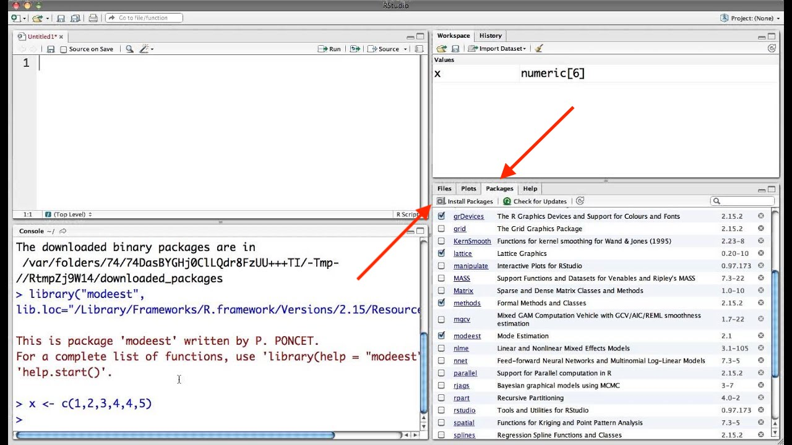
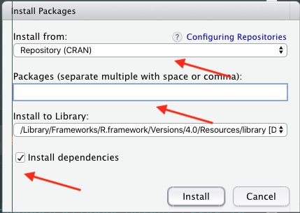
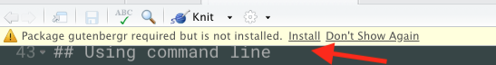
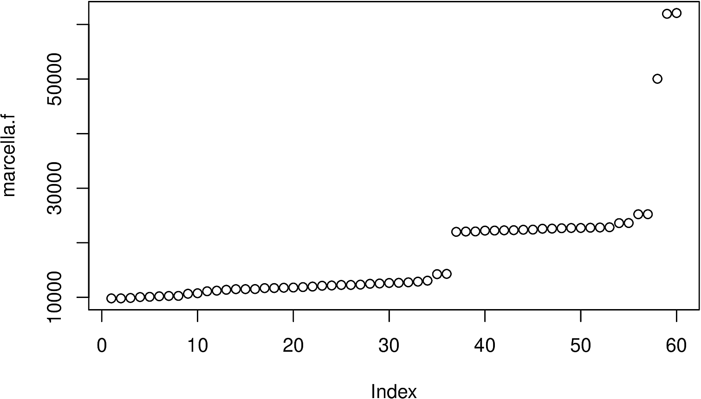
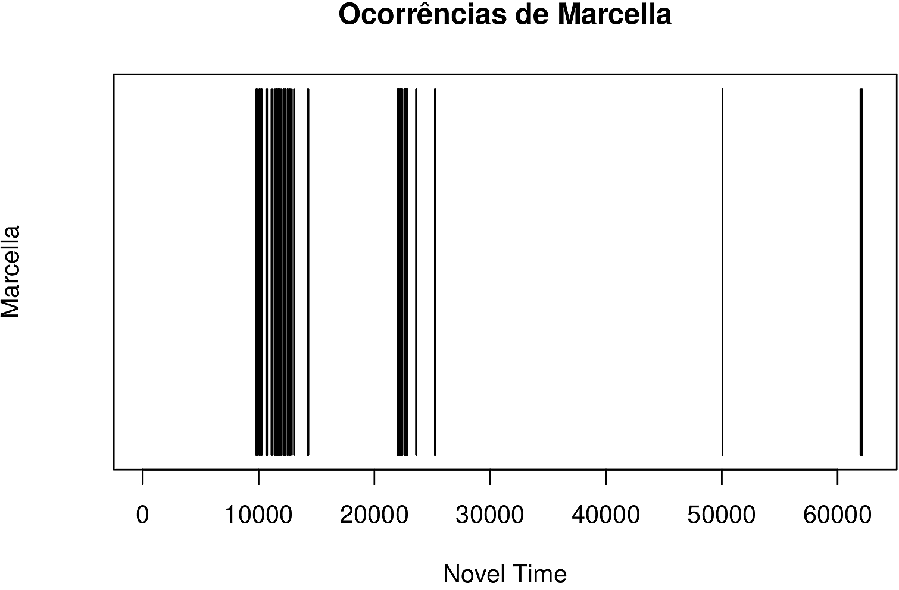
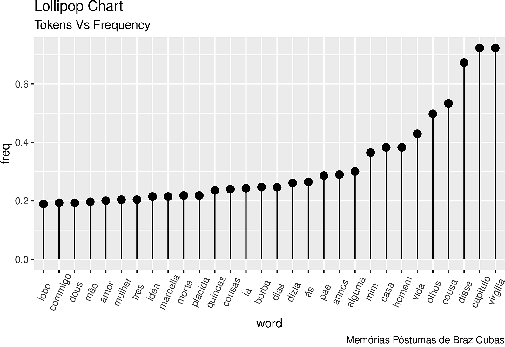

Rodrigo Esteves de Lima Lopes\
*Campinas State University*\
[rll307\@unicamp.br](mailto:rll307@unicamp.br)

# Project Gutenberg Analysis

# Our first analysis

## Packages

We will work with a classic work by Machado de Assis scraped from
[Gutenberg Project's](https://www.gutenberg.org/) website. This project
is responsible for making books that are in *public domain* available in
all languages. There are packages in R that allow us to do this kind of
scrapping automatically.

First we will download and install
[**gutenbergr**](https://github.com/ropensci/gutenbergr) and a few
others. There are two ways to do this, one is by the command line, the
other is by the Rstudio package administrator. Here I will show both.

## Checking the packages

First of all we will try to load all packages and see if it throws an
error:

``` {.r}
library(gutenbergr)
```

    ## Warning: package 'gutenbergr' was built under R version 4.0.2

``` {.r}
library(ggplot2)
library(dplyr)
```

    ## 
    ## Attaching package: 'dplyr'

    ## The following objects are masked from 'package:stats':
    ## 
    ##     filter, lag

    ## The following objects are masked from 'package:base':
    ## 
    ##     intersect, setdiff, setequal, union

``` {.r}
library(tidytext)
```

As you see I got an error:
`Show in New WindowClear OutputExpand/Collapse Output Error in library(gutenbergr): there is no package called ‘gutenbergr’`.
It means that the package `gutenbergr` is not installed.

### Install using your IDE

For installing the package using you IDE support, you will have to look
for the tab `packages`. Then you click on it. You will see a list of
your system's packages, the ones with the *tick* are loaded. To load a
package from IDE with no code, just *tick* package. To install a
package, click on install packages, type the name of the package and the
IDE will do the job for you. Please, do not forget to choose *install
dependencies*, so everything runs smoothly. The images bellow show the
process.



{width="50%"}

## Using command line

Go to console and type:

``` {.r}
install.packages('gutenbergr', dependencies=TRUE)
```

If you need some help in this command, just type in your console:

``` {.r}
?install.packages()
```

This procedure is standard in all R commands. If you type **?** followed
by a command, it will display help on that command automatically.

### If you are lucky

If you are lucky enough a message might pop up at the top of your script
editor. This is RStudio asking you to install the package, just click on
it



### What each package is for?

-   **dplyr** helps us to manipulate data

    -   We will have a tutorial about it

-   **tidytext** is for text manipulation

    -   It is a very important package, we will learn it along the way

-   **ggplot2** is for viewing

    -   It is a very important package, we will learn it along the way

-   **gutenbergr** scrapes Project Gutenberg's data

## Packages

After installing all necessary packages it is time to load the packages
again:

``` {.r}
library(gutenbergr)
library(ggplot2)
library(dplyr)
library(tidytext)
```

## Making an initial analysis

Each book in the Gutenberg project is identified by a unique number. In
this tutorial we are going to use number "54829" or *Memórias Póstumas
de Brás Cubas*

``` {.r}
M.0  <- gutenberg_download(54829)
```

    ## Determining mirror for Project Gutenberg from http://www.gutenberg.org/robot/harvest

    ## Using mirror http://aleph.gutenberg.org

Now if you type this command you are going to notice some character
errors:

``` {.r}
head(M.0)
```

    ## # A tibble: 6 x 2
    ##   gutenberg_id text                      
    ##          <int> <chr>                     
    ## 1        54829 "MEM\xd3RIAS P\xd3STHUMAS"
    ## 2        54829 ""                        
    ## 3        54829 "DE"                      
    ## 4        54829 ""                        
    ## 5        54829 "BRAZ CUBAS"              
    ## 6        54829 ""

THis is a Character encoding issue. It means that our texts are in other
encoding than UFT-08. If we run the following command, we will solve the
issue:

``` {.r}
M.1 <- M.0 %>% 
  mutate(text=iconv(text, from = "latin1", to = "UTF-8"))
```

A couple of things about the command above:

-   The pipe "**%\>%**" allows me to use the same variable (M.0) and
    pass it throw the next command. It help us to save some code. It is
    loaded with the *tidy* package.

-   I have a nested set of commands:

    -   **mutate**: creates a new column called *text* in my *M.1*
        variable
    -   This *text* column already exists, so I will overwrite it
    -   This *text* column will be converted from "latin1" to 'UFT-8',
        using the **iconv** command, that will be converting my original
        *text* column

Piping and nesting commands are very common practice in R. They prevent
us from running a number of commands. Now if I have a look at my
variable:

``` {.r}
head(M.1)
```

    ## # A tibble: 6 x 2
    ##   gutenberg_id text                
    ##          <int> <chr>               
    ## 1        54829 "MEMÓRIAS PÓSTHUMAS"
    ## 2        54829 ""                  
    ## 3        54829 "DE"                
    ## 4        54829 ""                  
    ## 5        54829 "BRAZ CUBAS"        
    ## 6        54829 ""

A couple of things must be observed regarding this `M.1`:

1.  There is a lot of empty lines and double spaces
2.  There is a lot of extra information at `M.1`'s the begging and the
    end
3.  There is some variation on caps (capital and not capital)

For our exercise today: 1. We do not need this extra information - Our
first analysis is going to focus on the main book 1. We do not need
extra lines 1. We are not going to consider the difference between
capital and small letters

First we will transform the text in a character vector, for stracting
the data

``` {.r}
M.1 <- M.1$text
```

we will find the beginning of the book. Usually it is on chapter 1:

``` {.r}
which(M.1== "CAPITULO I")
```

    ## [1] 91

The command which tells me it is on chapter 1. So I will assign it to a
variable:

``` {.r}
inicio <- which(M.1== "CAPITULO I") 
```

I will do the same, now using the word "FIM" (end in Portuguese)

``` {.r}
which(M.1 == "FIM")
```

    ## [1] 8267

``` {.r}
fim <- which(M.1 == "FIM")
```

Such an exercise is possible because Gutenberg project is very
consistent in terms of file formats. In different contexts, we would
have to make it manually. Now I will select the data I will work with:

``` {.r}
M.1.linhas <- M.1[inicio:fim]
```

Now we concatenate of the text (everything on one line). We will do this
for data manipulation. We will change it latter.

``` {.r}
M1.C <- paste(M.1.linhas, collapse=" ")
length(M1.C)
```

    ## [1] 1

Now to small caps

``` {.r}
M1.CB <- tolower(M1.C)
```

Now getting it to one word per line:

``` {.r}
M1.l <- strsplit(M1.CB, "\\W")
```

Let us find out how our object is organised and remove the list effect,
unnecessary here:

``` {.r}
M1.l.v <- unlist(M1.l)
View(M1.l.v)
typeof(M1.l.v)
```

    ## [1] "character"

Deleting blanks

``` {.r}
##Identifying which positions are empty
not.blanks <- which(M1.l.v!="")

# Deleting  the empty positions
M1.l.v <- M1.l.v[not.blanks] 
```

Now we are going to use some of the indexes to find some words:

``` {.r}
mypositions.v <- c(400,125,621)
M1.l.v[mypositions.v]
```

    ## [1] "digo" "na"   "se"

In the first command some random numbers show which are the positions we
are going to use as a reference. In the second, We use those indexes for
data checking. We could easily do:

``` {.r}
M1.l.v[1:30]
```

    ##  [1] "capitulo"   "i"          "obito"      "do"         "autor"     
    ##  [6] "algum"      "tempo"      "hesitei"    "se"         "devia"     
    ## [11] "abrir"      "estas"      "memorias"   "pelo"       "principio" 
    ## [16] "ou"         "pelo"       "fim"        "isto"       "é"         
    ## [21] "se"         "poria"      "em"         "primeiro"   "logar"     
    ## [26] "o"          "meu"        "nascimento" "ou"         "a"

Or even:

``` {.r}
M1.l.v[c(1,2,3)]
```

    ## [1] "capitulo" "i"        "obito"

I think Marcella is the most strong female character ins his book, let
us check how many times she is in the book.

``` {.r}
marcella.f <- which(M1.l.v=='marcella') 
length(marcella.f)
```

    ## [1] 60

``` {.r}
marcella.f
```

    ##  [1]  9810  9813  9886 10054 10095 10191 10254 10266 10657 10750 11115 11223
    ## [13] 11385 11498 11505 11515 11687 11702 11758 11796 11878 11975 12123 12171
    ## [25] 12269 12270 12329 12483 12538 12634 12660 12752 12877 13057 14250 14301
    ## [37] 22004 22057 22075 22228 22238 22282 22308 22387 22412 22570 22596 22660
    ## [49] 22709 22712 22757 22798 22842 23603 23617 25225 25236 50051 61961 62102

Her name is mentioned 60 times in all the positions we can see listed
above. Let us make some magic:

``` {.r}
plot(marcella.f)
```



Some conclusions:

1.  Marcella does not appears right at the begging of the novel
2.  She stops being referenced by her name 1/3 to the book's end

Preparing the data to make a more beautiful plot: - Transforming our
list of random words into a list of words with occurrences - See how it
was and comparing difference

``` {.r}
m.freqs.t<-table(M1.l.v)
View(m.freqs.t)
```

Sorting the list in descending order:

``` {.r}
sorted.m.freqs.t <- sort(m.freqs.t, decreasing=TRUE)
head(sorted.m.freqs.t,10)
```

    ## M1.l.v
    ##    a  que   de    e    o  não   um   me   se   do 
    ## 2706 2201 2107 2022 1986 1177 1023  988  736  714

We now a new vector full of NA (not applicable). Its function will be to
help create a relative marker of Marcella's position in the text:

``` {.r}
w.count.v <- rep(NA,length(M1.l.v))
```

Now we will take the Marcella.f use it to create a Vector where: - Each
occurrence of Marcella is 1 - Where Marcella does not occur is "NA"

``` {.r}
w.count.v[marcella.f] <- 1
View(w.count.v)
```

Now let us make a much more beautiful plot. In the following command: -
*w.count.v* has Marcella's occurrences - the other commands name the
plot

``` {.r}
plot(w.count.v, main="Ocorrências de Marcella",
     xlab="Novel Time", ylab="Marcella", type="h", ylim=c(0,1), yaxt='n')
```



Let us check which are the most frequent words? Now without grammatical
words? - We will need to load a stopwords list to help us.

``` {.r}
library(readr)
my.stopwords <- read_csv("stop_port2.csv", col_names = FALSE)
```

    ## Parsed with column specification:
    ## cols(
    ##   X1 = col_character()
    ## )

``` {.r}
colnames(my.stopwords)<-"word"
```

``` {.r}
library(tidytext)
library(tidyr)
library(dplyr)
geral.list.df <- data.frame(text = M1.CB, stringsAsFactors = F)
geral.list <- geral.list.df %>%
  unnest_tokens(word, text) %>%
  count(word, sort = TRUE) %>%
  anti_join(my.stopwords, by= "word")%>%
  mutate((freq = n / sum(n))*100) %>% 
  arrange(desc(n))
colnames(geral.list)<-c('word','n','freq')
```

Fixing mistakes

``` {.r}
new <- data.frame(c("às","à", "ella","elle","d","á"))
colnames(new)<-'word'
my.stopwords<-rbind(my.stopwords,new)
```

Redoing the list

``` {.r}
geral.list <- geral.list.df %>%
  unnest_tokens(word, text) %>%
  count(word, sort = TRUE) %>%
  anti_join(my.stopwords, by= "word")%>%
  mutate((freq = n / sum(n))*100) %>% 
  arrange(desc(n))
colnames(geral.list)<-c('word','n','freq')
```

Now plotting

``` {.r}
library(ggplot2)
library(forcats)
geral.list %>% 
  mutate(word = fct_reorder(word, freq)) %>%
  slice(1:30) %>%
  ggplot(., aes(x=word, y=freq))+
  geom_point(size=3) + 
  geom_segment(aes(x=word, 
                   xend=word, 
                   y=0, 
                   yend=freq)) + 
  labs(title="Lollipop Chart", 
       subtitle="Tokens Vs Frequency", 
       caption="Memórias Póstumas de Braz Cubas") + 
  theme(axis.text.x = element_text(angle=65, vjust=0.6))
```


