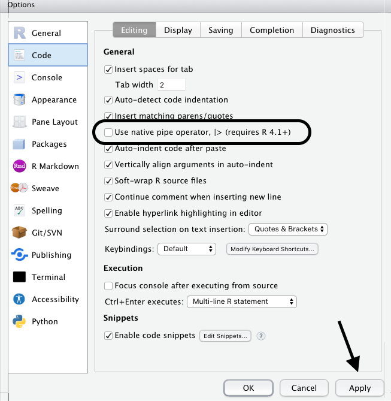

Rodrigo Esteves de Lima Lopes \
*Campinas State University* \
[rll307@unicamp.br](mailto:rll307@unicamp.br)

# A very introduction to dyplr


# Introduction

You might have observed that some commands showed up in our last tutorial:

1. select()
1. mutate()
1. rename()
1. count()
1. arrange()
1. filter()


Each of these commands (and many others, there is an cheatsheet for you) is loaded as we execute `library(dplyr)`. `dplyr` is part of the [`tidyverse`](https://www.tidyverse.org/) collection of packages for data science. They make the task to manipulate data easier than if we were using ordinary R commands. `dplyr` is usually referred as 'a grammar of data manipulation'. 

However, please, keep in mind that every task in R might be performed in different ways, using different commands or packages. 

We will discuss here some of the packages utilities, not all. If you need further information, please refer to the [`dplyr` website](https://dplyr.tidyverse.org/) or to the readme at [CRAN](https://cran.r-project.org/web/packages/dplyr/index.html). Remember that after loading the package, you can always type ?+command to get further information. 

# Using dplyr
## Loading the package 

We load the package using the following command:


```r
library(dplyr)
```

## Loading data
During this tutorial we are going to use `starwars`, a data frame with information regarding the film series (you can tell you professor is a geek). This data frame comes when you load the packages, and it is common that some packages bring some data for training purposes. So, run:


```r
head(starwars,10)
```

```
## # A tibble: 10 x 14
##    name    height  mass hair_color  skin_color eye_color birth_year sex   gender
##    <chr>    <int> <dbl> <chr>       <chr>      <chr>          <dbl> <chr> <chr> 
##  1 Luke S~    172    77 blond       fair       blue            19   male  mascu~
##  2 C-3PO      167    75 <NA>        gold       yellow         112   none  mascu~
##  3 R2-D2       96    32 <NA>        white, bl~ red             33   none  mascu~
##  4 Darth ~    202   136 none        white      yellow          41.9 male  mascu~
##  5 Leia O~    150    49 brown       light      brown           19   fema~ femin~
##  6 Owen L~    178   120 brown, grey light      blue            52   male  mascu~
##  7 Beru W~    165    75 brown       light      blue            47   fema~ femin~
##  8 R5-D4       97    32 <NA>        white, red red             NA   none  mascu~
##  9 Biggs ~    183    84 black       light      brown           24   male  mascu~
## 10 Obi-Wa~    182    77 auburn, wh~ fair       blue-gray       57   male  mascu~
## # ... with 5 more variables: homeworld <chr>, species <chr>, films <list>,
## #   vehicles <list>, starships <list>
```

The data frame brings some basic information about some of the main characters at the series. Here we printed only the 10 first rows. Let us run a `summary()` and a `str()` to check its structure:


```r
str(starwars)
```


```r
summary(starwars)
```

We have pretty long results, but some conclusions might be interesting:

- It is a data frame
- It has numeric, list and character columns
- It has only the seven main movies. 

## Filter

**Filter** is a command that might be used for filtering data based on a data frame. For example, I will filter all the "droids" in the classical movies:


```r
head(starwars %>%
       filter(species == "Droid"))
```

```
## # A tibble: 6 x 14
##   name   height  mass hair_color skin_color  eye_color birth_year sex   gender  
##   <chr>   <int> <dbl> <chr>      <chr>       <chr>          <dbl> <chr> <chr>   
## 1 C-3PO     167    75 <NA>       gold        yellow           112 none  masculi~
## 2 R2-D2      96    32 <NA>       white, blue red               33 none  masculi~
## 3 R5-D4      97    32 <NA>       white, red  red               NA none  masculi~
## 4 IG-88     200   140 none       metal       red               15 none  masculi~
## 5 R4-P17     96    NA none       silver, red red, blue         NA none  feminine
## 6 BB8        NA    NA none       none        black             NA none  masculi~
## # ... with 5 more variables: homeworld <chr>, species <chr>, films <list>,
## #   vehicles <list>, starships <list>
```

*head()* and *tail()* are important commands in **R** language, they will show us the top and bottom **6** lines of any variable I print on my terminal. There is also a second argument, numeric, that my increase or decrease the number of lines. Now let us see all humans.


```r
head(starwars %>%
       filter(species == "Human"), 3)
```

```
## # A tibble: 3 x 14
##   name     height  mass hair_color skin_color eye_color birth_year sex    gender
##   <chr>     <int> <dbl> <chr>      <chr>      <chr>          <dbl> <chr>  <chr> 
## 1 Luke Sk~    172    77 blond      fair       blue            19   male   mascu~
## 2 Darth V~    202   136 none       white      yellow          41.9 male   mascu~
## 3 Leia Or~    150    49 brown      light      brown           19   female femin~
## # ... with 5 more variables: homeworld <chr>, species <chr>, films <list>,
## #   vehicles <list>, starships <list>
```

Now I have the first three columns. Mind you that the number *3* came in a specific place inside the parenthesis: `command1(command2()3)`. It is so because it is part of `command1()`. The position of the arguments is something we have to keep in mind when we embed commands. 

Any logical operator can combine into a search:


```r
head(starwars %>%
       filter(species == "Human" & hair_color=="none"), 3)
```

```
## # A tibble: 3 x 14
##   name     height  mass hair_color skin_color eye_color birth_year sex   gender 
##   <chr>     <int> <dbl> <chr>      <chr>      <chr>          <dbl> <chr> <chr>  
## 1 Darth V~    202   136 none       white      yellow          41.9 male  mascul~
## 2 Lobot       175    79 none       light      blue            37   male  mascul~
## 3 Mace Wi~    188    84 none       dark       brown           72   male  mascul~
## # ... with 5 more variables: homeworld <chr>, species <chr>, films <list>,
## #   vehicles <list>, starships <list>
```

## Select

Select help me to get just a couple of information and display it 


```r
head(starwars %>% 
  select(name, ends_with("color")))
```

```
## # A tibble: 6 x 4
##   name           hair_color  skin_color  eye_color
##   <chr>          <chr>       <chr>       <chr>    
## 1 Luke Skywalker blond       fair        blue     
## 2 C-3PO          <NA>        gold        yellow   
## 3 R2-D2          <NA>        white, blue red      
## 4 Darth Vader    none        white       yellow   
## 5 Leia Organa    brown       light       brown    
## 6 Owen Lars      brown, grey light       blue
```

## Rename
Rename help us to change easily the name of a single column


```r
head(rename(flights,airline_car = carrier))
```

```
## # A tibble: 6 x 19
##    year month   day dep_time sched_dep_time dep_delay arr_time sched_arr_time
##   <int> <int> <int>    <int>          <int>     <dbl>    <int>          <int>
## 1  2013     1     1      517            515         2      830            819
## 2  2013     1     1      533            529         4      850            830
## 3  2013     1     1      542            540         2      923            850
## 4  2013     1     1      544            545        -1     1004           1022
## 5  2013     1     1      554            600        -6      812            837
## 6  2013     1     1      554            558        -4      740            728
## # ... with 11 more variables: arr_delay <dbl>, airline_car <chr>, flight <int>,
## #   tailnum <chr>, origin <chr>, dest <chr>, air_time <dbl>, distance <dbl>,
## #   hour <dbl>, minute <dbl>, time_hour <dttm>
```


## Mutate

`mutate()` allows me to create new columns based on some criteria I need. It draws data from existing columns and executes commands to add a new data column in my data frame. For this command let us use another built in R data frame called `nycflights13`:


```r
library(nycflights13)
summary(flights)
```

```
##       year          month             day           dep_time    sched_dep_time
##  Min.   :2013   Min.   : 1.000   Min.   : 1.00   Min.   :   1   Min.   : 106  
##  1st Qu.:2013   1st Qu.: 4.000   1st Qu.: 8.00   1st Qu.: 907   1st Qu.: 906  
##  Median :2013   Median : 7.000   Median :16.00   Median :1401   Median :1359  
##  Mean   :2013   Mean   : 6.549   Mean   :15.71   Mean   :1349   Mean   :1344  
##  3rd Qu.:2013   3rd Qu.:10.000   3rd Qu.:23.00   3rd Qu.:1744   3rd Qu.:1729  
##  Max.   :2013   Max.   :12.000   Max.   :31.00   Max.   :2400   Max.   :2359  
##                                                  NA's   :8255                 
##    dep_delay          arr_time    sched_arr_time   arr_delay       
##  Min.   : -43.00   Min.   :   1   Min.   :   1   Min.   : -86.000  
##  1st Qu.:  -5.00   1st Qu.:1104   1st Qu.:1124   1st Qu.: -17.000  
##  Median :  -2.00   Median :1535   Median :1556   Median :  -5.000  
##  Mean   :  12.64   Mean   :1502   Mean   :1536   Mean   :   6.895  
##  3rd Qu.:  11.00   3rd Qu.:1940   3rd Qu.:1945   3rd Qu.:  14.000  
##  Max.   :1301.00   Max.   :2400   Max.   :2359   Max.   :1272.000  
##  NA's   :8255      NA's   :8713                  NA's   :9430      
##    carrier              flight       tailnum             origin         
##  Length:336776      Min.   :   1   Length:336776      Length:336776     
##  Class :character   1st Qu.: 553   Class :character   Class :character  
##  Mode  :character   Median :1496   Mode  :character   Mode  :character  
##                     Mean   :1972                                        
##                     3rd Qu.:3465                                        
##                     Max.   :8500                                        
##                                                                         
##      dest              air_time        distance         hour      
##  Length:336776      Min.   : 20.0   Min.   :  17   Min.   : 1.00  
##  Class :character   1st Qu.: 82.0   1st Qu.: 502   1st Qu.: 9.00  
##  Mode  :character   Median :129.0   Median : 872   Median :13.00  
##                     Mean   :150.7   Mean   :1040   Mean   :13.18  
##                     3rd Qu.:192.0   3rd Qu.:1389   3rd Qu.:17.00  
##                     Max.   :695.0   Max.   :4983   Max.   :23.00  
##                     NA's   :9430                                  
##      minute        time_hour                  
##  Min.   : 0.00   Min.   :2013-01-01 05:00:00  
##  1st Qu.: 8.00   1st Qu.:2013-04-04 13:00:00  
##  Median :29.00   Median :2013-07-03 10:00:00  
##  Mean   :26.23   Mean   :2013-07-03 05:22:54  
##  3rd Qu.:44.00   3rd Qu.:2013-10-01 07:00:00  
##  Max.   :59.00   Max.   :2013-12-31 23:00:00  
## 
```

If you do not have it installed, please do it. The instructions are in a previous tutorial. `nycflights13` brings all data on Flights in New York airports during the year of 2013, and it is a great tool for training data manipulation. The data brings some information regarding the delays (arrivals and departures). I want a new column that will show me the total of delay a plane might have. 


```r
mutate(flights, total_delay = arr_delay+dep_delay)%>%
  select(total_delay)%>%
  head()
```

```
## # A tibble: 6 x 1
##   total_delay
##         <dbl>
## 1          13
## 2          24
## 3          35
## 4         -19
## 5         -31
## 6           8
```
Notice that here instead of embedding the command, the *pipe* `%>%` was my syntax choice. Initially the the *pipe* `%>%` function was introduced in R by the package `magrittr` which is able to do much much more than just pipening our code.

If I want to select more than a column I will have to save it as a variable:


```r
delayed_flights <- mutate(flights, total_delay = arr_delay + dep_delay)
head(select(delayed_flights, carrier, total_delay))
```

```
## # A tibble: 6 x 2
##   carrier total_delay
##   <chr>         <dbl>
## 1 UA               13
## 2 UA               24
## 3 AA               35
## 4 B6              -19
## 5 DL              -31
## 6 UA                8
```


However, from `R 4.10` on, it is now possible to use a native *pipe* operator `|>`. The reasons to such change is that the use of `%>%` takes much more in terms of memory than any R native resources. There are two ways of activating native `|>`:

- Get any version over `R 4.10` that it will work out of the box
  - For MacOS users: it has been just updated
- Activate on preferences > code



If you want to see a complete discussion on the differences between the two approaches, I would recommend the following [video](https://www.youtube.com/watch?v=wmvjxb6Gdm8)

So, from now on I will be using `%>%` or `|>` interchangeably. 

## Arrange and filter

To discuss arrange and filter I will get back to our previous Gutenberg project data frame:


```r
geral.list <- geral.list.df %>%
  unnest_tokens(word, text) %>%
  count(word, sort = TRUE) %>%
  anti_join(my.stopwords, by= "word")%>%
  mutate((freq = n / sum(n))*100) %>% 
  arrange(desc(freq))
colnames(geral.list)<-c('word','n','freq')
```

- `anti_join`: excludes whatever is in the column `word` in `my.stopwords` file. 
- `arrange`: arrange the data according to some criterion, here the column `freq` in descending order. 


