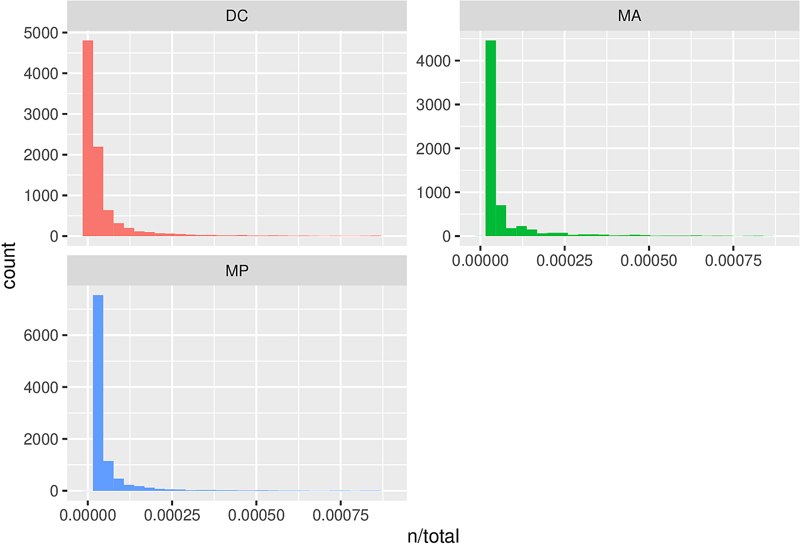
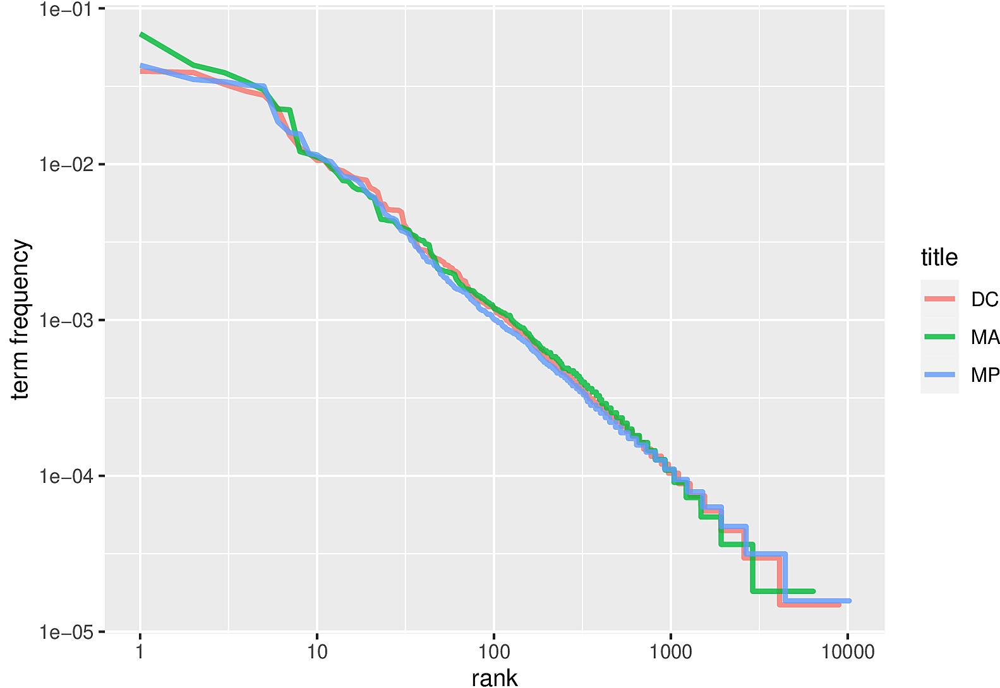
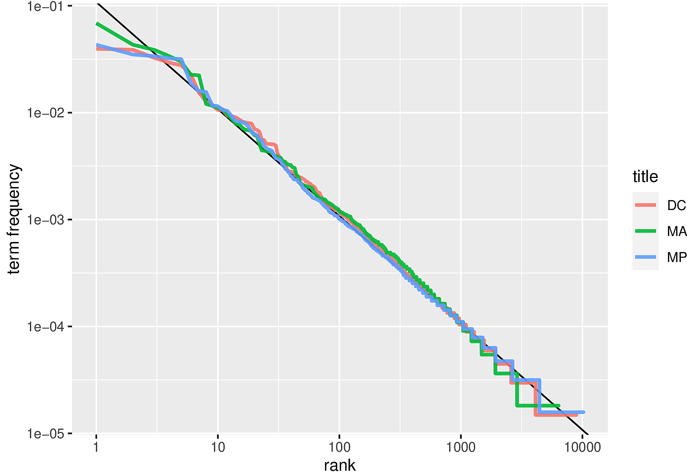
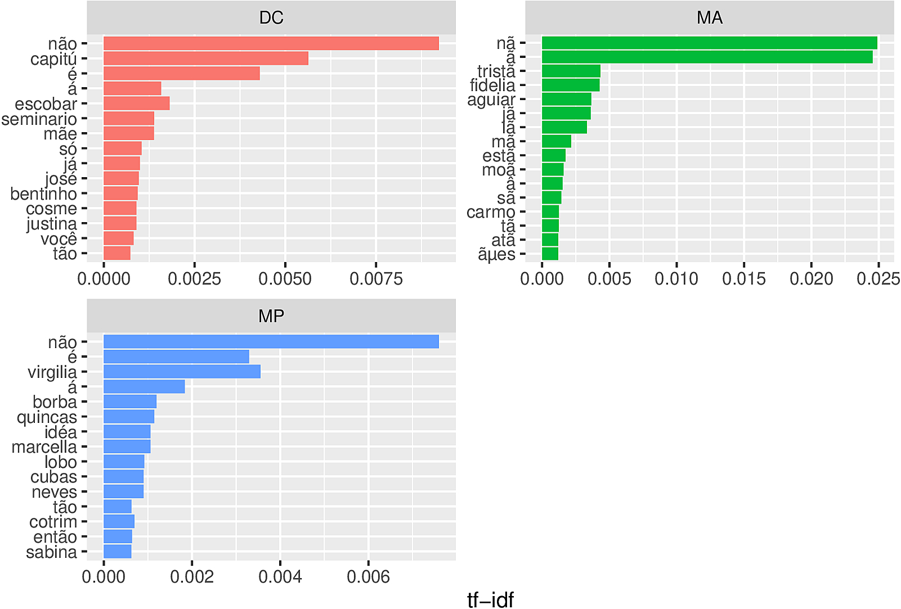

Rodrigo Esteves de Lima Lopes\
*Campinas State University*\
[rll307\@unicamp.br](mailto:rll307@unicamp.br)

# Project Gutenberg Analysis part 2

## Preliminar notes

This is notebook is based on the book:

> Silge, Julia, and David Robinson. 2017. *Text Mining with R: A Tidy Approach*. First edition. Beijing/Boston: O'Reilly.

# Comparing books

In this tutorial we will use some books by of *Machado de Assis* available at [Projeto Gutemberg](https://www.gutenberg.org/) in order to create a comparison between the different lexical choices present in each book.

## Loading packages

To carry out this tutorial, we need to load some packages:

``` {.r}
library(dplyr)
library(tidytext)
library(ggplot2)
library(gutenbergr)
```

1.  `library (dplyr)` is for data manipulation
2.  `library (tidytext)` is for text manipulation
3.  `library (ggplot2)` is for plotting
4.  `library (gutenbergr)` downloads data from [Project Gutemberg](https://www.gutenberg.org/)

For some reason,project gutemberg is not going to following commands will scrape the books and convert the characters to a compatible encoding

``` {.r}
#Memórias Póstumas (MP)
MP.bruto <- gutenberg_download(54829) |>
  mutate(text=iconv(text, from = "latin1", to = "UTF-8"))
```

    ## Determining mirror for Project Gutenberg from http://www.gutenberg.org/robot/harvest

    ## Using mirror http://aleph.gutenberg.org

``` {.r}
MP.bruto$title<-"MP"

#Dom Casmurro (DM)
DC.bruto <- gutenberg_download(55752) |>
  mutate(text=iconv(text, from = "latin1", to = "UTF-8"))
DC.bruto$title<-"DC"

#Memorial de Ayres (MA)
MA.bruto <- gutenberg_download(55797) |>
  mutate(text=iconv(text, from = "latin1", to = "UTF-8"))
MA.bruto$title<-"MA"
```

## Organising the data

First of all we will join ou books in a single data frame:

``` {.r}
machado.bruto <- rbind(MP.bruto,DC.bruto,MA.bruto)
```

The following commands will organise the lexis in the file based on some criteria: - `unnest_tokens (word, text)` splits one word per line, from the column **text** that contains the lines of the novels - `count (title, word, sort = TRUE)` counts the words in each novel; - `ungroup ()` breaks words by line.

``` {.r}
machado.p.1 <- machado.bruto  |>
  unnest_tokens(word, text)  |>
  count(title, word, sort = TRUE)  |>
  ungroup()
```

Now let us see the total words per title:

``` {.r}
machado.total <- machado.p.1  |>
  group_by(title)  |>
  summarize(total = sum(n))
```

    ## `summarise()` ungrouping output (override with `.groups` argument)

Now, we are going to add the number of words to the general table.

``` {.r}
machado.palavras <- left_join(machado.p.1, machado.total)
```

    ## Joining, by = "title"

## Plotting

Now let us do some plotting. The package `ggplot2` will give us a hand

``` {.r}
ggplot(machado.palavras, aes(n/total, fill = title)) +
  geom_histogram(show.legend = FALSE) +
  xlim(NA, 0.0009) +
  facet_wrap(~title, ncol = 2, scales = "free_y")
```

    ## `stat_bin()` using `bins = 30`. Pick better value with `binwidth`.

    ## Warning: Removed 385 rows containing non-finite values (stat_bin).

    ## Warning: Removed 3 rows containing missing values (geom_bar).



## Raking our lexis

The plots above compare the words in their absolute numbers. It would be interesting for us to establish a ranking amongst those words. This would help us to separate purely grammatical words from those that can bring some reflection on the content. Let us do it step by step.

``` {.r}
machado.palavras.rank <- machado.palavras  |>
  group_by(title)  |>
  mutate(rank = row_number(),
         `term frequency` = n/total)
```

Now let us plot and see the difference

``` {.r}
machado.palavras.rank   |>
  ggplot(aes(rank, `term frequency`, color = title)) +
  geom_line(size = 1.1, alpha = 0.8, show.legend = TRUE) +
  scale_x_log10() +
  scale_y_log10()
```

<!-- -->

Now let's calculate the regression of those words. This will help us to know whether, within the repetitions we see, such averages are expected or not.

``` {.r}
rank_subset <- machado.palavras.rank  |>
  filter(rank < 500,
         rank > 10)

lm(log10(`term frequency`) ~ log10(rank), data = rank_subset)
```

    ## 
    ## Call:
    ## lm(formula = log10(`term frequency`) ~ log10(rank), data = rank_subset)
    ## 
    ## Coefficients:
    ## (Intercept)  log10(rank)  
    ##     -0.9148      -1.0113

Now let us see how it fits our old plotting

``` {.r}
machado.palavras.rank  |>
  ggplot(aes(rank, `term frequency`, color = title)) +
  geom_abline(intercept = -0.966, slope = -1.0004, color = "black", linetype = 1) +
  geom_line(size = 1.1, alpha = 0.9, show.legend = TRUE) +
  scale_x_log10() +
  scale_y_log10()
```

<!-- -->

The black line gives us the normality. We observe that few words are above or below it, with variations in each work.

That done, let us calculate the importance that each of these words have in our texts, and then use it.

``` {.r}
machado.palavras.imp  <- machado.palavras   |>
  bind_tf_idf(word, title, n)
```

``` {.r}
machado.palavras.imp   |>
  arrange(desc(tf_idf))  |>
  mutate(word = factor(word, levels = rev(unique(word))))  |>
  group_by(title)  |>
  top_n(15)  |>
  ungroup()  |>
  ggplot(aes(word, tf_idf, fill = title)) +
  geom_col(show.legend = FALSE) +
  labs(x = NULL, y = "tf-idf") +
  facet_wrap(~title, ncol = 2, scales = "free") +
  coord_flip()
```

    ## Selecting by tf_idf

<!-- -->
