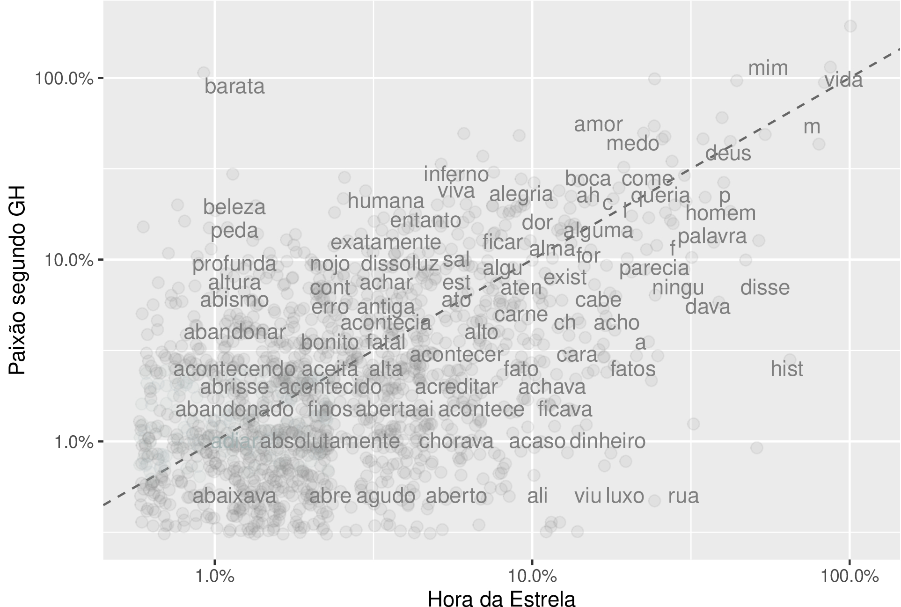

Rodrigo Esteves de Lima Lopes \
*Campinas State University* \
[rll307@unicamp.br](mailto:rll307@unicamp.br)

# TidyText: Reviewing in a set of Clarisse Lispector Novels

# Introduction

## Purpose of this notebook

In this post I am going to discuss some strategies of comparison between texts. It was produced in order to assist colleagues who work in the area of Corpus Linguistics and Systemic Functional Linguistics, as a way to use R in their research. It is part of my CNPq-funded project and seeks to make corpus tools and network analysis accessible. If you have any doubts or wish to make any research contact please send me an email.

This document is based mostly in the package [Tidytext](https://www.rdocumentation.org/packages/tidytext/versions/0.2.1) and in the following book:

Silge, Julia and David Robinson. 2017. Text Mining with R: A Tidy Approach. First edition. Beijing/Boston: O’Reilly.


## Clarisse Lispector

In this notebook I am going to compare two novels by Clarisse Lispector: A Hora da Estrela and A Paixão segundo GH in their original Portuguese version. Some more information about Lispector might be found [here](https://en.wikipedia.org/wiki/Clarice_Lispector).


# Loading R packages

In this article we are going to use the following packages:


```r
library(tidytext)
library(dplyr)
library(readr)
library(tidyverse)
library(tm)
library(tidyr)
library(scales)
```

Each of these packages has a specific function:

1. `tidytext`: Text manipulation
1. `dplyr`: Data manipulation, such as tables and data frames
1. `readr`: Reads documents and data into R
1. `tidyverse`: Text manipulation, it loads some functions from other packages
1. `tm`: Text manipulation and corpus creation
1. `tidyr`: Data manipulation, such as tables and data frames
1. `scales`: Data representation

# Analysis

## Data and stop-words

Since my focus here is on the semantically relevant Lexis, I will load a list of stop words, in order to filter prepositions, articles and conjunctions. There are a number of stop-words list for Portuguese, I would advise you to prepare your own based on your research objectives. The code bellow also loads the two novels in R.


```r
stopwords <- data.frame(read_csv("stop_port2.csv", col_names = FALSE),stringsAsFactors = FALSE)
```

```
## 
## -- Column specification --------------------------------------------------------
## cols(
##   X1 = col_character()
## )
```

```r
colnames(stopwords)<-"word"
```

```r
head(stopwords,10)
```

```
##       word
## 1       tá
## 2        a
## 3   acerca
## 4    adeus
## 5    agora
## 6    ainda
## 7     alem
## 8  algumas
## 9     algo
## 10 algumas
```


```r
estrela <- readLines("estrela.txt")
```

```
## Warning in readLines("estrela.txt"): incomplete final line found on
## 'estrela.txt'
```


```r
paixao <- readLines("paixao.txt")
```

```
## Warning in readLines("paixao.txt"): incomplete final line found on 'paixao.txt'
```

## Analysis

### Create a wordlist

Our fist step will be processing the two novels in a set of words with their frequencies.


```r
estrela <- data.frame(text = estrela, stringsAsFactors = F)
```


```r
estrela.tidy <- estrela  |>
  unnest_tokens(word, text) |>
  anti_join(stopwords, by="word")
```


```r
paixao <- data.frame(text = paixao, stringsAsFactors = F)
```


```r
paixao.tidy <- paixao  |>
  unnest_tokens(word, text) |>
  anti_join(stopwords, by="word")
```


In the code above:

    The first line creates a data frame from each novel. It is important to make the files processable by R.
    The following lines process the data frame in order to:
        Make it in a word per line format
        Filter stop-words out.

Here is an example of how it reads:


```r
head(paixao.tidy)
```

```
##           word
## 1.1 procurando
## 1.3 procurando
## 1.5   tentando
## 2     entender
## 2.1   tentando
## 2.4     alguém
```

As we can see, there is a column which displays a sequential number, representing the line of the list, and another which displays the words itself. However it is also possible to observe that *procurando* is present twice in the list. It happens because we are not counting  occurrences, but only displaying the novel's words.


```r
paixao.l<- paixao.tidy |>
  count(word, sort = TRUE)
```


```r
esterla.l <- estrela.tidy |>
  count(word, sort = TRUE)
```

The code above transforms these lists in something similar to a word list. The first line creates the file itself, which I chose to name with the suffix "*.l". The operator " |>" is part of the tidyverse, its function is to help us to "pass" one line of code through to the other and perform more than a command at once. The following code counts the words and creates a new column with the results.


```r
head(paixao.l, 10)
```

```
##       word   n
## 1      mim 227
## 2     vida 193
## 3   barata 180
## 4     amor 111
## 5     medo  87
## 6    mundo  87
## 7    olhos  79
## 8     deus  77
## 9  verdade  66
## 10   sabia  64
```


```r
head(esterla.l, 10)
```

```
##        word  n
## 1   macabéa 90
## 2      vida 83
## 3  história 55
## 4      moça 54
## 5       mim 48
## 6     disse 47
## 7     sabia 47
## 8  olímpico 46
## 9    glória 44
## 10       si 37
```

Our next step is to build a table comparing the frequency of such words. It is necessary in order to generate the visualisations and make the analysis possible. In the first line we create a new object and add two columns in it, one for each book, and make sure that the list of words identify to the book where it is from. I the following line we clear the text, keeping only alphabetical words and deleting numbers and special symbols. We group the words by book (*livro* in Portuguese) and calculate the relative proportion of the words within each novel. Since absolute values do not mean much, we delete them.


```r
frequencia.clarisse <- bind_rows(mutate(paixao.tidy, livro = "P"),
                       mutate(estrela.tidy, livro = "H"))  |>
  mutate(word = str_extract(word, "[a-z']+"))  |>
  count(livro, word)  |>
  group_by(livro)  |>
  mutate(proportion = (n / sum(n))*100)  |>
  select(-n)  |>
  spread(livro, proportion)
```


## Visualising the data

Now it is time to compare the Lexis in the two books. We will do so by using a ggplot command. Mostly we are putting both novels side by side, making them overlap. The position is calculated my a log scale that helps to represent the overlapping. The more central a word is in the graphic, the less "specific" of a book it is.


```r
ggplot(frequencia.clarisse, aes(x = H, y = P,
                      color = abs(H - P))) +
  geom_abline(color = "gray40", lty = 2) +
  geom_jitter(alpha = 0.1, size = 2.5, width = 0.3, height = 0.3) + 
  geom_text(aes(label = word), check_overlap = TRUE, vjust = 1.5) + 
  scale_x_log10(labels = percent_format()) +
  scale_y_log10(labels = percent_format()) + 
  scale_color_gradient(limits = c(0, 0.001),
                       low = "darkslategray4", high = "gray75") +
  theme(legend.position="none") + 
  labs(y = "Paixão segundo GH", x = "Hora da Estrela")
```

```
## Warning: Removed 5500 rows containing missing values (geom_point).
```

```
## Warning: Removed 5501 rows containing missing values (geom_text).
```

<!-- --> 


