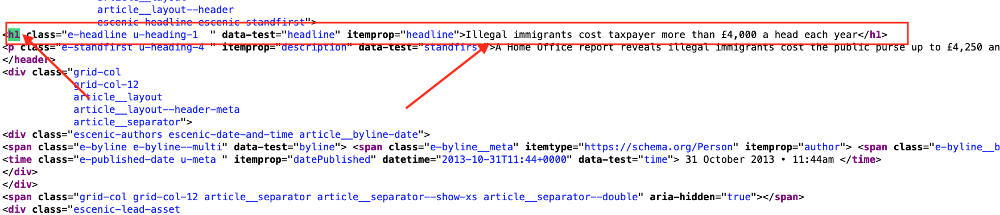

```{r setup, include=FALSE}
knitr::opts_chunk$set(echo = TRUE)
library(rvest)
library(purrr)
library(xml2) 
library(stringr)
library(dplyr)
load("/Volumes/GoogleDrive/My Drive/Profissional/Pedagogico/UNICAMP/disciplinas/pos/R/lp192_2021/scrape.RData")
```


# Introduction

This file will discuss specifically how to scrape data for replicating Lima-Lopes (2020). Please note that we will not make the whole corpus available here due to copyright. If you choose to reproduce this paper all articles have to be scraped by you. It is also important to observe that some articles might have been taken offline (actually by the time of this replication some already have). 

# Packages and some remarks

## General context

I think that website data scraping is one the most difficult tasks in Linguistics. This is because each website has a different CSS and each designer organises his/her own code in a very particular way. So, in order to run the functions bellow, and probably reproduce them in other experiments, we will have to always have a look at the page source to verify which is the code that we holds the pieces of information we need. 

We are going to analyse three British Newspapers [The Sun](https://www.thesun.co.uk/), [The Daily Star](https://www.dailystar.co.uk/) and [The Daily Telegraph](https://www.telegraph.co.uk/). 

## Packages
We are going to use the following packages for scraping:

1. `rvest`: Wrappers around the 'xml2' and 'httr' packages to make it easy to download, then manipulate, HTML and XML.
1. `purrr`: A set of tools for creating functions (it will be necessary for data extraction)
1. `xml2`: It reads XML code (necessary for rvest)
1. `stringr`: String manipulation
1. `dplyr`: Data manipulation

```{r Packages}
library(rvest)
library(purrr)
library(xml2) 
library(stringr)
library(dplyr)
```

# Scraping the articles
## Introduction to `rvest`

The package `rvest` aims to scrape (or harvest) data from web pages. To know the address or addresses beforehand is necessary for this package's approach. Initially, it its quite simple, let us try with one of ou addresses:

```{r ex1}
#reads the address form the web
test <- read_html('https://www.telegraph.co.uk/news/uknews/immigration/10417222/Illegal-immigrants-cost-taxpayer-more-than-4000-a-head-each-year.html')
```
It produces a list with the webpage and the codes which identify them in terms of tags and functions, but still very difficult for us to read. DEspite of that, we need to navigate to this code in order to find out were the information we need is. I would suggest to use a borwser named [Firefox](https://www.mozilla.org/en-US/firefox/new/) which has an very interesting function: it easly shows the code of a webpage in a ways it gets a little simpler to read. In the pictures 1 and 2 (bellow) we can see the menu and an indication where the **title** of the article is. 

 
 


Since I want to get the title of the article, I will run the following command:

```{r gettitle}
test |>
  html_nodes("h1") |> #finds the HTML field
  html_text() # prints the text
```

The problem with this approach is that if we have a lot of articles, it would be difficult to run one each time. 


## Importing addreess

I have prepared a *csv file with the address we are going to use, each file contains the address of a single newspaper. It will help us to seepd up the scraping. We start by importing them:

```{r importing}
articles_DS <- readr::read_csv("articles_DS.csv")
articles_DS <- as_vector(articles_DS)

articles_TT <- readr::read_csv('articles_TT.csv')
articles_TT <- as_vector(articles_TT)

articles_TS <- readr::read_csv("articles_TS.csv")
articles_TS <- as_vector(articles_TS)
```

Please, note that each address data frame is converted into a vector. This helps us to run the functions for data scraping. 

## General function

In this post I will use the function `map_dfr()`, as it applies a function recursively during a vector and prints a data frame as a result. In general terms our arguments are:

1. `.x = article`: vector with the addresses
1. `.f` a function we apply in the data

A general function for our newspaper scraping would be:

```{r ex2, eval=FALSE, echo=TRUE}
map_dfr(.x = article, # my vector with addresses
        .f = function(x){ #the function, embraced by {}, creating a tibble
          tibble(Title = read_html(x) %>% #extracting the html code
                   html_nodes('h1') %>% #extracting the title
                   html_text(), #extracting the title's text
                 Content = read_html(x) %>% 
                   html_nodes("p") %>% 
                   html_text())}) -> TT.df #extracting the content of the article and saving as tibble
```


Please note that with this format I will have to use the assignment `->` after the function mapped. Naturally I can simplify it using a pipe:

```{r ex3, eval=FALSE, echo=TRUE}
TT.df <- article |> 
  map_dfr(.f = function(x){
    tibble(Title = read_html(x) %>%
             html_nodes('h1') %>%
             html_text(),
           Content = read_html(x) %>%
             html_nodes("p") %>%
             html_text())})
```

### Daily Star

Now let us scrap *The Daily Star*. 

```{r, sc1, eval=FALSE, echo=TRUE}
map_dfr(.x = articles_DS,
        .f = function(x){
          tibble(Title = read_html(x) %>%
                   html_nodes("title") %>%
                   html_text(),
                 Content = read_html(x) %>%
                   html_nodes("p") %>%
                   html_text())}) -> DS.df
```

If we have a look at `DS.df` we are going to notice that the code scraped all the paragraphs and idetified each of them with the title. 

We now need to collapse it in a single line per article. One possibility would be the command

```{r join1, eval=FALSE, echo=TRUE}
DS.df <- aggregate(Content ~ Title, DS.df, FUN = paste, collapse = ' ')
```

Finally we are going to 1) identify each article source and ascribe a unique ID:

```{r ID01 , eval=FALSE, echo=TRUE}
DS.df$site <- 'DailyStar' #Source
DS.df$ID <- paste0('DailyStar', 1:length(DS.df))
head(DS.df)
```


### The Telegraph

We are going to follow the same path Please, have a look at the `html_nodes` parameter. For the aggregation of lines, I am suggesting a different approach (with dplyr/tidyverse), please, use the one you like best. 

```{r, src2, eval=FALSE, echo=TRUE}
map_dfr(.x = articles_TT,
        .f = function(x){
          tibble(Title = read_html(x) %>%
                   html_nodes('h1') %>%
                   html_text(),
                 Content = read_html(x) %>%
                   html_nodes("p") %>%
                   html_text())}) -> TT.df
TT.df <- TT.df %>%
  group_by(Title) %>%
  summarise(Content = str_c(Content, collapse = " "),
            .groups = 'drop')
TT.df$site <- 'TheTelegraph'
TT.df$ID <- paste0('TT', 1:length(TT.df$site))
```

### The Sun

Here the code is similar, but a little changes are necessary: 1) `html_nodes` has a different content; 2) The lines do not repeat themselves, so the do not need to aggregate and create the source and ID directly in the code.

```{r, src3, eval=FALSE, echo=TRUE}
map_dfr(.x = articles_TS,
        .f = function(x){
          tibble(Title = read_html(x) %>%
                   html_nodes('title') %>%
                   html_text(),
                 Content = read_html(x) %>%
                   html_nodes(xpath = "//div[@class='article__content']") %>%
                   html_text(),
                 Site = "TheSun"
                 )}) -> TS.df
TS.df$ID <- paste0('TS', 1:length(articles_TS.df$Address))
```


# Saving each file as a Data Frame

The following script help us to save each file in our local disk. 

```{r, save, eval=FALSE, echo=TRUE}
TSt.df <- data.frame(TS.df) #Necessary due to compatibility

my.files <- as_vector(TSt.df$ID) # Making a vector for the indexing

location <- list() # empty list

for (i in 1:length(my.files)) { # looping for locating each file in my data frame
  location[[i]] <- grep(my.files[i], TSt.df[,4])
}

for (i in 1:length(my.files)) { # gets each location in my files
  file.name <- paste(my.files[i], ".txt", sep = "") #paste the name of ID as file name
  sink(file.name) # Open the connection to a empty file
  print(as_vector(TSt.df[location[[i]],2])) # prints each line as a vector into the file
  gsub("\r?\n|\r", " ", file.name) 
  sink()
}
```


