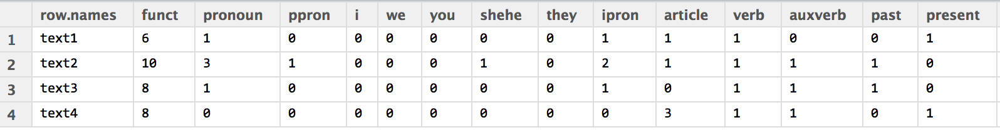
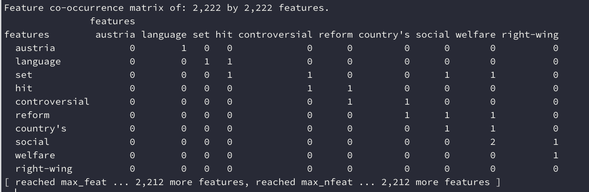
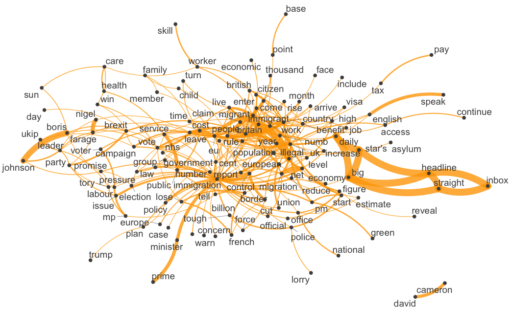
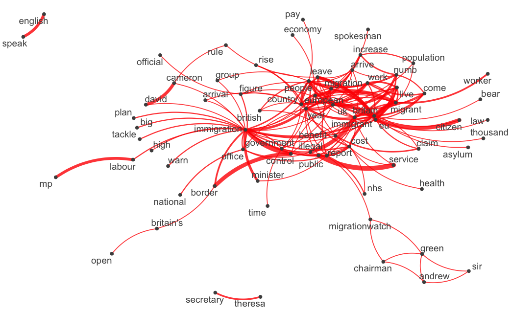
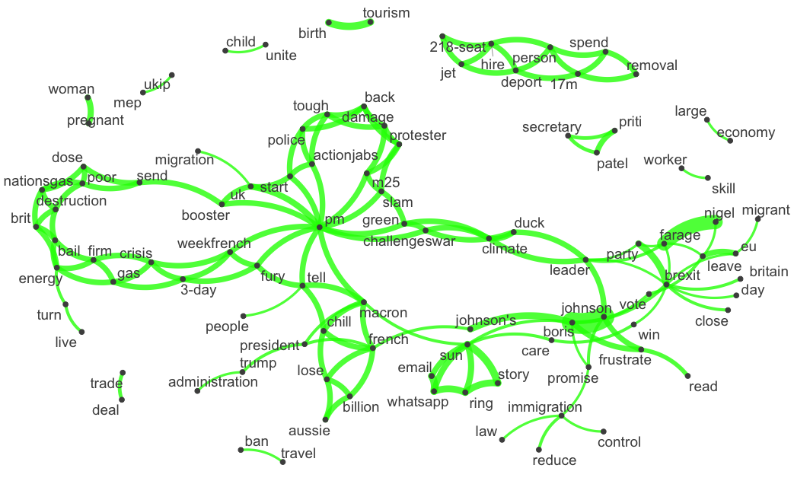
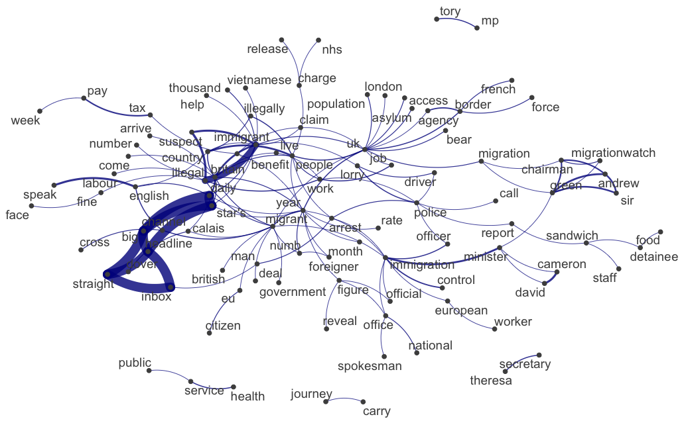

# Sentiment analysis and LSF
## Replication of Lima-Lopes (2020) - Part 2

Rodrigo Esteves de Lima Lopes\
*Campinas State University*\
[rll307@unicamp.br](mailto:rll307@unicamp.br)

# Introduction

This file will discuss specifically how to prepare our data for replicating Lima-Lopes (2020). Please note that we will not make the whole corpus available here due to copyright. If you choose to reproduce this paper all articles have to be scraped by you. It is also important to observe that some articles might have been taken offline (actually by the time of this replication some already have). 

Our objective is threefold:

1. Prepare the corpora for sentiment analysis
1. Prepare the corpora for network analysis using R scripts
1. Prepare and export the corpora for network analysis using other software, more specifically [Gephi](https://gephi.org/). Unfortunately, a tutorial on [Gephi](https://gephi.org/) is beyond the scope of this tutorial. 

## Packages 


```r
library(quanteda)
library(quanteda.textplots)
library(quanteda.textstats)
```

In this tutorial we are going to use three packages:

- `quanteda` - for text processing
- `quanteda.textplots` - for plotting graphs using `quanteda`
- `quanteda.textstats` - for text statistics

# Building the corpora

Our first step is to load a personalised stopword list and convert it to a vector:


```r
My.Stopwords <- readr::read_csv(file.choose()) 
My.Stopwords  <- My.Stopwords |>
  purrr::as_vector()
```

In the code above:

1. `readr::read_csv(file.choose())` calls the package `readr`, its function `read_csv` which imports a *csv* file. The nested function `file.choose()` opens a window for choosing such a list.
1. `purrr::as_vector()` class the function `as_vector()` from the package `purrr` in order to convert my stopword list into a vector. 

The next step is to make a corpus from each newspaper and a general containing all articles. A `corpus` is a formal class to run `quanteda` commands. 


```r
# one by one
TS.Corpus <- corpus(TS.df, text_field = 'Content')
DS.Corpus <- corpus(DS.df, text_field = 'Content')
TT.Corpus <- corpus(TT.df, text_field = 'Content')

#General
News.Corpus <- rbind(TT.df,TS.df, DS.df)
News.Corpus <- corpus(News.Corpus, text_field = 'Content')
```

Please note:

- The `field_command` tells `quanteda` what should be considered the text.
- The `doc_id` variable is now the formal identification of each text. 
Our next step is to create a `token` variable for each corpus. A `token` is an index of words and their positions within each file. Please note that we are also doing some cleaning, deleting numbers, URLs and punctuation. If your research depends on this elements, please keep them. 


```r
TS.tokens  <- tokens(TS.Corpus,
                    what = "word",
                    remove_punct = TRUE,
                    remove_symbols = TRUE,
                    remove_numbers = TRUE,
                    remove_url = TRUE,
                    split_hyphens = FALSE,
                    include_docvars = TRUE,
                    padding = FALSE,
                    verbose = quanteda_options("verbose")
                    )

DS.tokens <- tokens(DS.Corpus,
                    what = "word",
                    remove_punct = TRUE,
                    remove_symbols = TRUE,
                    remove_numbers = TRUE,
                    remove_url = TRUE,
                    split_hyphens = FALSE,
                    include_docvars = TRUE,
                    padding = FALSE,
                    verbose = quanteda_options("verbose")
                    )
TT.tokens <- tokens(TT.Corpus,
                    what = "word",
                    remove_punct = TRUE,
                    remove_symbols = TRUE,
                    remove_numbers = TRUE,
                    remove_url = TRUE,
                    split_hyphens = FALSE,
                    include_docvars = TRUE,
                    padding = FALSE,
                    verbose = quanteda_options("verbose")
                    ) 
News.tokens <- News.Corpus |>
  tokens(what = "word",
         remove_punct = TRUE,
         remove_symbols = TRUE,
         remove_numbers = TRUE,
         remove_url = TRUE,
         split_hyphens = FALSE,
         include_docvars = TRUE,
         padding = FALSE,
         verbose = quanteda_options("verbose")
  )
```

Now we are going to keep on cleaning and preparing the corpora. In the sequence below we:
1. Clean the corpora from two stopword lists: our personalised list and `quanteda`s built in list
1. Lemmatise our copora, using the lists available in the package `lexicon`
  - In this case, we do a simple substitution


```r
TS.tokens <- tokens_remove(TS.tokens, c(stopwords("english"),My.Stopwords)) 
TS.tokens <- tokens_replace(TS.tokens, 
                            pattern = lexicon::hash_lemmas$token,
                            replacement = lexicon::hash_lemmas$lemma) |>
  tokens_tolower()

DS.tokens <- tokens_remove(DS.tokens, c(stopwords("english"), 
                                        My.Stopwords)) 
DS.tokens <- tokens_replace(DS.tokens, 
                            pattern = lexicon::hash_lemmas$token,
                            replacement = lexicon::hash_lemmas$lemma) |>
  tokens_tolower()

TT.tokens <- tokens_remove(TT.tokens, c(stopwords("english"),My.Stopwords)) 
TT.tokens <- tokens_replace(TT.tokens, 
                            pattern = lexicon::hash_lemmas$token,
                            replacement = lexicon::hash_lemmas$lemma) |>
  tokens_tolower()


News.tokens <- tokens_remove(News.tokens, c(stopwords("english"),My.Stopwords)) 
News.tokens <- tokens_replace(News.tokens, 
                            pattern = lexicon::hash_lemmas$token,
                            replacement = lexicon::hash_lemmas$lemma) |>
  tokens_tolower()
```

In order to get our data ready for the network analysis we will:

1. Creating a `dfm`
1. Choosing the more frequent lemmas (150 in this study)

A `DFM` is a space matrix which tells us which words are in each text of a corpus. It also tells us the frequency of such words. 


```r
news.dfm <- dfm(News.tokens)
news.top <- names(topfeatures(news.dfm, 150))

TT.dfm <- dfm(DS.tokens)
TT.top <- names(topfeatures(DS.dfm, 150))

DS.dfm <- dfm(DS.tokens)
DS.top <- names(topfeatures(DS.dfm, 150))

TS.dfm <- dfm(TS.tokens)
TS.top <- names(topfeatures(TS.dfm, 150))
```




Now our last pre-processing step: creating a `fcm` and filtering it with our top dfm results. A `fcm` is a matrix of co-occurrence of words inside a document or corpus. 




```r
TS.fcm <- fcm(
  TS.tokens,
  context = 'window',
  count = "frequency",
  window = 2L,
  weights = NULL,
  ordered = FALSE,
  tri = TRUE
)
TS.fcm.top <- fcm_select(TS.fcm , pattern = TS.top)

DS.fcm <- fcm(
  DS.tokens,
  context = 'window',
  count = "frequency",
  window = 2L,
  weights = NULL,
  ordered = FALSE,
  tri = TRUE
)

DS.fcm.top <- fcm_select(DS.fcm , pattern = DS.top)

TT.fcm <- fcm(
  TT.tokens,
  context = 'window',
  count = "frequency",
  window = 2L,
  weights = NULL,
  ordered = FALSE,
  tri = TRUE
)

TT.fcm.top <- fcm_select(TT.fcm , pattern = TT.top)

News.fcm <- fcm(
  News.tokens,
  context = 'window',
  count = "frequency",
  window = 2L,
  weights = NULL,
  ordered = FALSE,
  tri = TRUE
)

News.fcm.top <- fcm_select(News.fcm , pattern = news.top)
```

# Plotting a network

First, we will export our data in order to plot them using [Gephi](www.gephi.org):


```r
write.csv(TS.CC,"TS.csv")
write.csv(DS.CC,"DS.csv")
write.csv(TT.CC,"TT.csv")
write.csv(News.CC,"News.csv")
```

then plot each `fcm` using `textplot_network()` command


```r
textplot_network(News.fcm.top, min_freq = 4, edge_color = "orange", edge_alpha = 0.8, edge_size = 5)

textplot_network(TS.fcm.top, min_freq = 4, edge_color = "green", edge_alpha = 0.8, edge_size = 5)

textplot_network(DS.fcm.top, min_freq = 3, edge_color = "darkblue", edge_alpha = 0.8, edge_size = 5)

textplot_network(TT.fcm.top, min_freq = 3, edge_color = "red", edge_alpha = 0.8, edge_size = 3)
```


The results are:













