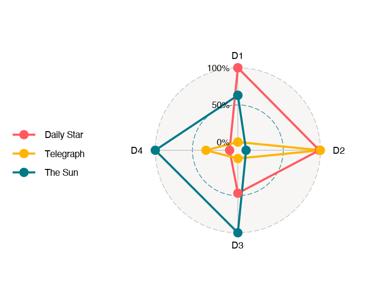

# Sentiment analysis and LSF
## Replication of Lima-Lopes (2020) - Part 3

Rodrigo Esteves de Lima Lopes\
*Campinas State University*\
[rll307@unicamp.br](mailto:rll307@unicamp.br)


# Introduction

In this section we are going to:

1.  Run the factor analysis and observe how each feature in the dictionary co-occurs
2.  Analyse this co-occurrence in terms of their features and name them
3.  Create correlation graphics.
4.  Analyse how each news paper performs in terms of the dimensions we have found.

# Packages

For this script we are going to need three packages:


```r
library(psych)
library(ggradar)
library(scales)
library(ggcorrplot)
library(quanteda)
library(dplyr)
```

-   `psych` : for statistical analysis
-   `ggradar and ggcorrplot`: for plotting
-   `scales`: for scaling the the samples

Three packages, `ggcorrplot`, `psych` and `scales` might be installed using ordinary `Rstudio` interface. However, `ggradar` needs a special command, since it is not provided by [CRAN](https://cran.r-project.org/).


```r
devtools::install_github("ricardo-bion/ggradar", 
                         dependencies = TRUE)
```

# The analysis

Our first step is to select which columns of `news.Cal` we are going to use. Please, note we are going to use the same data as we have in the last script.


```r
News.Cal <- News.Cal[,2:11] |> # selects all columns but docs_id
  as.matrix() # makes it a matrix
```

Now let us have a look at it:


```r
News.Cal |>
  head()
```

```
##     adj.1 adj.2 adj.3  MC.1  MC.2  MC.3    vp    EM  NP.1  NP.2
## TT1  0.00 17.65  1.96 19.61  1.96  7.84  7.84 15.69 27.45  1.96
## TT2  4.65  8.14  0.00 13.95  5.81 13.95  8.14 31.40 13.95 11.63
## TT3  4.49  7.05  3.85 10.90 14.74  9.62 14.10 23.08 12.18  2.56
## TT4  2.97  1.98 14.85 11.88  6.93 24.75 14.85 15.84  5.94  7.92
## TT5  1.16  5.81  6.98 15.12  8.14  5.81 24.42  3.49 29.07  3.49
## TT6  0.00 21.74  4.35  4.35  4.35 13.04 34.78 17.39  0.00 13.04
```

## Finding the correlation

At this point we are going to find which stratetigies correlates to another


```r
correlation <- cor(News.Cal)
```

Now, let us have a look at it


```r
correlation |>
  head()
```

```
##              adj.1       adj.2       adj.3        MC.1        MC.2         MC.3
## adj.1  1.000000000 -0.23559549  0.03438985 -0.12775887 -0.22208554 -0.009096788
## adj.2 -0.235595489  1.00000000 -0.27579727 -0.08031926 -0.21137381 -0.129220718
## adj.3  0.034389854 -0.27579727  1.00000000 -0.08793089 -0.24050311 -0.087980498
## MC.1  -0.127758867 -0.08031926 -0.08793089  1.00000000 -0.24961389 -0.126803906
## MC.2  -0.222085541 -0.21137381 -0.24050311 -0.24961389  1.00000000 -0.094047316
## MC.3  -0.009096788 -0.12922072 -0.08798050 -0.12680391 -0.09404732  1.000000000
##                vp         EM       NP.1        NP.2
## adj.1  0.03526823 -0.1256717 -0.2703500  0.02159987
## adj.2 -0.10168850  0.1190035  0.1005970  0.04193045
## adj.3  0.30105795 -0.4508993 -0.1951412  0.07145120
## MC.1  -0.17877188 -0.3388446  0.3648656 -0.07948572
## MC.2  -0.13603886  0.1847230 -0.2113601 -0.07546887
## MC.3  -0.20228451 -0.1532016 -0.1844379  0.27397069
```

### Plotting

Now, it is possible to make a plot out of it:


```r
ggcorrplot::ggcorrplot(correlation, 
                       method = "circle", 
                       outline.color = "darkgrey", 
                       hc.order = TRUE,
                       insig = "blank",
                       show.diag=FALSE, 
                       sig.level=0.05,
                       legend.title = "Corr.", 
                       ggtheme=ggplot2::theme_minimal())
```

The result is:


## Creating the Factors and analysing the dimensions.

The facto analysis is simple, we just need one command:


```r
factors <- factanal(News.Cal, 4, rotation = "promax")
```

Now we save the element `loadings` for our inspection


```r
factor.final <- factors[["loadings"]]
```

Now let us have a look at it:


```r
factor.final
```

```
## 
## Loadings:
##       Factor1 Factor2 Factor3 Factor4
## adj.1          0.362   0.207         
## adj.2 -0.178           0.268         
## adj.3  0.364   0.203   0.134  -0.153 
## MC.1   0.401  -0.274   0.123   0.207 
## MC.2   0.108   0.104  -1.056   0.128 
## MC.3   0.160   0.342           0.361 
## vp     0.163   0.107   0.127  -0.958 
## EM    -1.046           0.130   0.184 
## NP.1   0.232  -0.976   0.150   0.160 
## NP.2           0.275                 
## 
##                Factor1 Factor2 Factor3 Factor4
## SS loadings      1.537   1.426   1.324   1.206
## Proportion Var   0.154   0.143   0.132   0.121
## Cumulative Var   0.154   0.296   0.429   0.549
```

### Factor per newspaper

Now we are going to analyse how each journal instantiates meanings in the four dimensions.

Our first step is to apply factor analysis using `principal` a command from `psych`. Our focus will be each file individually.


```r
fit2 <- principal(News.Cal, 
                  nfactors = 4, rotate = "cluster")
```

Our next step is to save the results that interest us the most.


```r
scores.files <- as.data.frame(fit2[["scores"]])
```

The final step is to identify the files according to the orign


```r
newspapers <- data.frame(newspapers = c(rep('TT', 27),
                                        rep("TS",21),
                                        rep("DS",50)
))

scores.files <- cbind(newspapers,scores.files)
```

Now let us have a look at it:


```r
scores.files |>
  head()
```

```
##     newspapers         RC1        RC2        RC3        RC4
## TT1         TT -0.64338845  2.2568899 -0.3669865  2.1170060
## TT2         TT -1.34642938  0.6136556  0.8238202  0.9010358
## TT3         TT -0.87935128  0.2076209 -0.5572842  0.2444274
## TT4         TT -0.00682284  0.3593490  1.2619289 -0.4912996
## TT5         TT  0.57123201  1.8013208 -0.9884341  0.6285740
## TT6         TT  0.85281728 -1.4775334  0.7178692  2.9666028
```

Although we are not going to explore it, this data frame would be a good source to analyse how and why each piece of news behaves individually.

Our almost final steps are:

1.  Save each newspaper set of articles, in order to
2.  Take the means of each newspaper regarding each dimensio
3.  Identify the newspapers
4.  Rescale for plotting
5.  Save all together in order to plot them


```r
DS.av <- subset(scores.files, newspapers == "DS", -newspapers)
TT.av <- subset(scores.files, newspapers == "TT", -newspapers)
TS.av <- subset(scores.files, newspapers == "TS", -newspapers)

DS <- t(colMeans(DS.av, na.rm = TRUE))
TT <- t(colMeans(TT.av, na.rm = TRUE))
TS <- t(colMeans(TS.av, na.rm = TRUE))

newspaper <- c("Daily Star", "The Sun", "Telegraph")
dimensions <- c("D1", "D2", "D3"

general.means <- as.data.frame(rbind(DS,TT,TS), row.names = newspaper,
                               col.names = dimentions)
colnames(general.means) <- dimensions

radar1 <- general.means %>% 
  as_tibble(rownames = "newspaper") %>% 
  mutate_at(vars(-newspaper), rescale)
```

Let us have a look at it:


```r
radar1
```

```
## # A tibble: 3 x 5
##   D1            D2    D3    D4     D4
##   <chr>      <dbl> <dbl> <dbl>  <dbl>
## 1 Daily Star 1     0.173 0.589 0     
## 2 The Sun    0.513 1     1     1     
## 3 Telegraph  0     0     0     0.0887
```

Finally we plot it


```r
ggradar(radar1)
```

The final result is:


