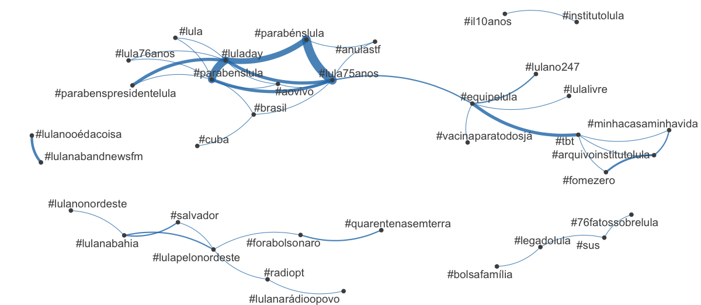
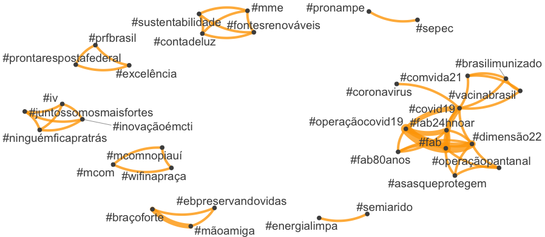
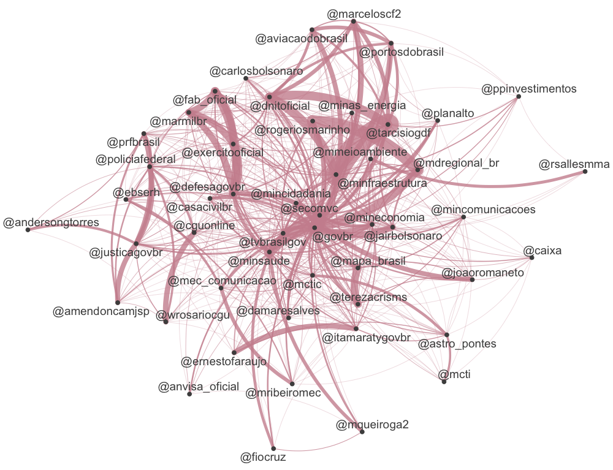

# Quanteda and Twitter - 2
Rodrigo Esteves de Lima Lopes \
*Campinas State University* \
[rll307@unicamp.br](mailto:rll307@unicamp.br)


# Introduction

[Quanteda](https://quanteda.io/) is a package for managing and analyse text quantitatively. It is quite easy to use and will bring us a number of interesting functions. 

## You will need:

1. The package [`Quanteda`](https://quanteda.io/), `quanteda.textplots` and `quanteda.textstats` which can be installed using [RStudio](http://www.sthda.com/english/wiki/installing-and-using-r-packages)
1. The package `rtweet`, we installed [last tutorial](https://github.com/MiDiTeS/intro_to_R1/blob/master/Module_3/04_rtweet.md). 
1. Package `DT` for viewing the KWIC inside R. 

# Scraping Tweets

We are going to use the same data we have used in the previous tutorials.

# Doing some analysis

## Creating a network of hashtags for each president

First we will do the magic for Lulla. We are going to:

1. Select the hashtags using the command `dfm_select`
1. Select the 50 more frequent using `topfeatures` command


```r
tag.LI <- dfm_select(LI.dfm, pattern = ("#*"))
toptag.LI <- names(topfeatures(ttag.LI, 50))
```


Now let us construct a feature-occurrence matrix for the hashtags


```r
tag.fcm.LI <- fcm(tag.LI)
```

Let us make a FCM only with the top hashtags


```r
top.plot.LI <- fcm_select(tag.fcm.LI, pattern = toptag.LI)
```

And then we make our network


```r
textplot_network(top.plot.LI, 
                 min_freq = 0.1, 
                 edge_alpha = 0.8, 
                 edge_size = 5)
```

Let us see how is the final product



Now let us see how it works for JB, all in a single batch of commands:


```r
tag.JB <- dfm_select(JB.dfm, pattern = ("#*"))
toptag.JB <- names(topfeatures(tag.JB, 50))
tag.fcm.JB <- fcm(tag.JB)
top.plot.JB <- fcm_select(tag.fcm.JB, pattern = toptag.JB)
textplot_network(top.plot.JB, 
                 min_freq = 0.1, 
                 edge_alpha = 0.8, 
                 edge_size = 5,
                  edge_color = "orange")
```



## Analysing user interactions

We can use the same methodology to study users interaction. The difference we are going to change the search for `*#` to `*@`. Let us start by Lula, but in a single command:


```r
user.LI <- dfm_select(LI.dfm, pattern = ("@*"))
topuser.LI <- names(topfeatures(user.LI, 50))
user.fcm.LI <- fcm(user.LI)
user.plot.LI <- fcm_select(user.fcm.LI, pattern = topuser.LI)
textplot_network(user.plot.LI, 
                 min_freq = 0.1, 
                 edge_alpha = 0.8, 
                 edge_size = 5,
                 edge_color = "red")
```


The result would be something similar to it:


Now let us do the same for JB


```r
covas.user.dfm <- dfm_select(covas.dfm, pattern = "@*")
topuser.covas <- names(topfeatures(covas.user.dfm, 50))
head(topuser.covas)

covas.user.fcm <- fcm(covas.user.dfm)
View(covas.user.fcm)

covas.user.plot <- fcm_select(covas.user.fcm, 
                              pattern = topuser.covas)
textplot_network(covas.user.plot, 
                 min_freq = 0.1, 
                 edge_color = "pink3", 
                 edge_alpha = 0.8, 
                 edge_size = 5)
```


The result should be something similar to:




