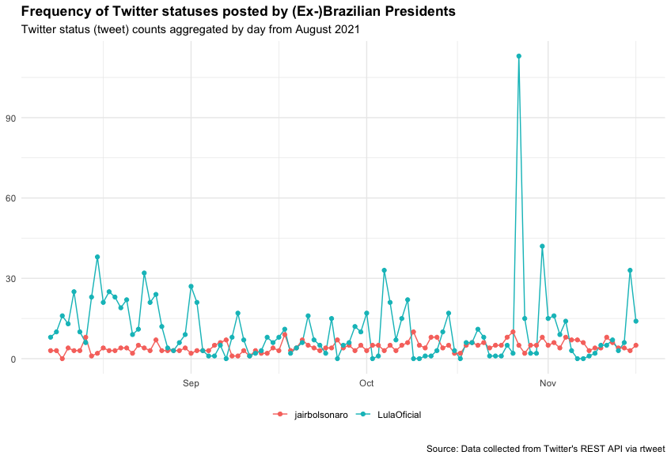

```{r setup, include=FALSE}
knitr::opts_chunk$set(echo = TRUE)
library(rtweet)
load("/Volumes/GoogleDrive/My Drive/Profissional/Pedagogico/UNICAMP/disciplinas/pos/R/lp192/twitter01.RData")
```

# Introduction

Our main objective here is to have first contact with network with a data scraping package. In this case, `rtweet`. Twitter has been one of the oldest surviving social media, and it also has been an important source for data studying at the Computer Mediated Communication studies in the last few years. But please, take into account that the data we collect might be influenced by a number of factors:

1. My location: Twitter’s algorithm is known to change the results depending of our location
1. A different kind of account (professional, personal or premium) offers different results in terms of how many of twitters  we my get
1. Our network capacity might influence the results

## What are we going to need

1. A valid [Twitter](https://twitter.com/) account
1. The package [rtweet](https://github.com/ropensci/rtweet)

### Responsible data use

Please, keep in mind that any data scraping should be done in accordance to Twitter’s [terms and conditions](https://developer.twitter.com/en/developer-terms/more-on-restricted-use-cases). 
# Scraping some data

## Twitter locations

First we are going to get some insights on what is trending in our location. So we start by checking which are the locations available:

```{r, get_trends, eval=FALSE, echo=TRUE}
all.trends<-trends_available()
```

If we have a close look, `my.trends<-trends_available()` delivers a table with numbers, cities and countries. Please, mind you that some locations might not be listed. In this case, I would choose your countries location. I am from São Paulo - Brazil, so I will try to get the trends available there. If we look at the table, São Paulo is ID `455827`. So we will get the trends using this number. 

```{r get_trends_sp, eval=FALSE, echo=TRUE}
br.trends<-get_trends(woeid=455827)
```

Again we have a table. But please, mind you it is a snapshot of Twitter at the moment data was collected, it tends to change, sometimes, by the minute. 

## Getting some tweets

In my data, the term **Grammy** called my attention, so I will search for it. There are two ways to do so:

1. `stream_tweets()`: searches tweets for a given period of time
1. `search_tweets()`:  searches tweets until it gets specified number of occurrences

### stream_tweets

- **Advantages**: it collects as much tweets as possible in a given period of time
- **Disadvantages**: it tends to get connection and parsing errors when we search for long periods of time. There is a function called recover_stream.R, written by [Johannes Gruber](https://github.com/JBGruber) (who we are quite deeply thankful) and available [here](https://gist.github.com/JBGruber), that might sort the problem most sometimes. But *most* means: if our file is too much damaged, it will not work as we intend. 

Let us make some search using `stream_tweets`:

```{r stream1, eval=FALSE, echo=TRUE}

br.T1 <- stream_tweets('#Grammy', 
                       timeout = 60, #in seconds
                       file_name='t01', # it saves a file, not a variable
                       parse=TRUE)
```

Now to load this tweets we will need the following command:

```{r parse, eval=FALSE, echo=TRUE}
SP.tweets <- parse_stream("t01.json")
````

If we look at this file, there is a lot of possible variables to explore, over 90 columns with a lot of information regarding our tweets. 

### search_tweets()

- **Advantages**: it collects a certain number of tweets. Always returns nice parsed files. 
- **Disadvantages**: if you do not have a researcher or premium account, number of instances might be limited. 

Due to time, we will search for some tweets only:

```{r stream2,eval=FALSE, echo=TRUE}

BR.t2 <- search_tweets(
  "Grammy", n = 1000, include_rts = TRUE
  )
```

The result is a similar data frame. However, I have posted now and in the past (backwards)  tweets. 

## Some bonus features

Let us get the timeline form a politician:

```{r timeline,eval=FALSE, echo=TRUE}
boulos <- get_timeline("GuilhermeBoulos",n=1000)
```

Let us get his followers

```{r followers,eval=FALSE, echo=TRUE}
boulos.flw <- get_followers("GuilhermeBoulos", n = 75000)
```

Now let us get some information regarding some of those followers

```{r, followersinfo,eval=FALSE, echo=TRUE}
boulos.flw2 <- boulos.flw[1:100,]
info <- lookup_users(boulos.flw2$user_id)
```

Let us get some users with our term in their bios:

```{r, has2 ,eval=FALSE, echo=TRUE}
users <- search_users("Grammy", n = 1000)
```

Let us get the timelines for the two possible candidates in the next Brazilian's elections:

```{r timeline2,eval=FALSE, echo=TRUE}
presidentes <- get_timelines(c("jairbolsonaro", "LulaOficial"), n = 3200)
```

Now let us plot the frequency:

```{r plot_final,eval=FALSE, echo=TRUE}
library(ggplot2)

presidentes %>%
  dplyr::filter(created_at > "2021-08-01") %>%
  dplyr::group_by(screen_name) %>%
  ts_plot("days", trim = 7L) +
  ggplot2::geom_point() +
  ggplot2::theme_minimal() +
  ggplot2::theme(
    legend.title = ggplot2::element_blank(),
    legend.position = "bottom",
    plot.title = ggplot2::element_text(face = "bold")) +
  ggplot2::labs(
    x = NULL, y = NULL,
    title = "Frequency of Twitter statuses posted by (Ex)Brazilian Presidents",
    subtitle = "Twitter status (tweet) counts aggregated by day from August 2021",
    caption = "\nSource: Data collected from Twitter's REST API via rtweet"
  )
```

Which conclusions can we get?




